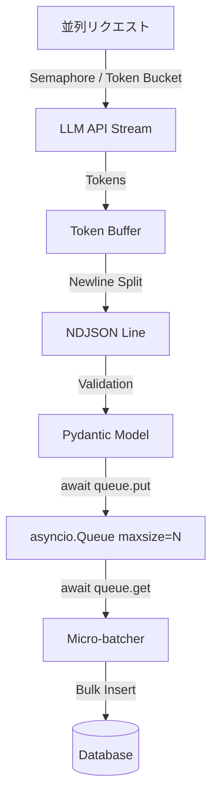

# 課題16：Pydanticによる不完全なLLM出力JSONの修復と構造化バリデーション (Robust LLM Ingestion Pipeline)

### 💻 課題16：PydanticによるLLMレスポンスの構造化パースと堅牢な型安全性の確保

本プロジェクトは、AI機能を組み込んだFinTech SaaS等におけるLLM出力の型安全性と信頼性を担保するための構造化パース（Pydantic Validation）とエラーリカバリの実装検証です。
顧客のチャット履歴や請求書画像からLLM（大規模言語モデル）を用いて取引データを抽出し、基幹システムに自動登録するパイプラインを開発しています。

しかし、本番環境のLLM APIは非常に気まぐれです。
- マークダウンのコードブロック（` ```json ... ``` `）で囲んで出力してくる。
- 出力の途中でトークン制限に達し、末尾の閉じ括弧（`}`）が欠損する。
- 数値のはずの金額を `"1,500"` や `"1500.00 JPY"` などの不適切なフォーマットの文字列で出力する。
- 通貨コードを `"usd"` のように小文字で出力する。

これらの不完全なJSON文字列が流れてきた際、パイプラインをクラッシュさせることなく、**正規表現や文字列操作による自動修復（Auto-Healing）**と、**Pydanticによる厳格なスキーマ検証（Schema Validation）**を行い、どうしても修復できない不正データのみを**DLQ（Dead Letter Queue：デッドレターキュー）**へ隔離する、堅牢なデータインジェクション（流し込み）処理を構築しなさい。

---

### 🚨 設計において考慮すべき極限状態の要件：

1. **LLM出力JSONの自動修復ロジック（Auto-Healing）の実装:**
   `json.loads()` にかける前に、以下のパターンの崩れたJSONを文字列操作や正規表現で自動修復しなさい。
   - 前後に付与されたマークダウンブロック（` ```json ` や ` ``` `）の除去。
   - JSONの前後にある不要な説明テキスト（プレアンブル/ポストアンブル）のトリミング（最初の `{` から最後の `}` までを抽出）。
   - 末尾の閉じ括弧 `}` の欠損に対する自動補完（簡易的な修復試行）。

2. **Pydantic v2モデルを用いた構造化とカスタム検証:**
   Pydantic v2 の `BaseModel` を定義し、以下のバリデーションおよびクリーニングを実行しなさい。
   - `transaction_id`: `str`（必須。`tx_` から始まる文字列であること。満たさない場合はエラー）。
   - `user_id`: `str`（必須。`usr_\d+` の正規表現パターンにマッチすること）。
   - `amount`: `float`（必須。正の実数であること。文字列で渡された場合も数値にパース・変換できること）。
   - `currency`: `str`（必須。ISO 4217規格に準拠する3文字の英大文字。小文字で入ってきた場合は**自動で大文字に正規化（例: `usd` -> `USD`）**し、`USD`, `JPY`, `EUR`, `GBP` のいずれかであること）。
   - `timestamp`: `datetime`（必須。ISO 8601フォーマットの文字列を自動で `datetime` オブジェクトにキャストする）。

3. **DLQ（Dead Letter Queue）パターンの適用:**
   パイプラインを途中で落とさない（`try-except` による徹底した防御）。
   - 正常にパース・検証できたレコードは `Success` リストへ格納する。
   - パースエラー、またはPydanticのバリデーションエラーとなったレコードは、エラー理由（エラー内容のサマリー）を添えて `DLQ` リストへ隔離し、後から監査できるようにしなさい。

---

### 📥 入力データの仕様

入力は、LLMが出力した生の文字列のリストです。

```python
raw_llm_outputs = [
    # 1. 完全なJSON
    '{"transaction_id": "tx_101", "user_id": "usr_999", "amount": 1500.0, "currency": "JPY", "timestamp": "2026-06-25T15:00:00Z"}',
    
    # 2. マークダウンで囲まれている
    '```json\n{"transaction_id": "tx_102", "user_id": "usr_888", "amount": 2500.5, "currency": "USD", "timestamp": "2026-06-25T15:01:00Z"}\n```',
    
    # 3. 前後に不要な解説テキストがある
    'Here is the extracted transaction: {"transaction_id": "tx_103", "user_id": "usr_777", "amount": 300, "currency": "EUR", "timestamp": "2026-06-25T15:02:00Z"} hope this helps!',
    
    # 4. 末尾の閉じ括弧が欠けている（かつ通貨が小文字）
    '{"transaction_id": "tx_104", "user_id": "usr_666", "amount": 120.0, "currency": "gbp", "timestamp": "2026-06-25T15:03:00Z"',
    
    # 5. 通貨が小文字（自動大文字変換で救済可能）
    '{"transaction_id": "tx_105", "user_id": "usr_555", "amount": "99.9", "currency": "eur", "timestamp": "2026-06-25T15:04:00Z"}',
    
    # 6. 金額がマイナス（Pydanticバリデーションエラー -> DLQ）
    '{"transaction_id": "tx_106", "user_id": "usr_444", "amount": -10.0, "currency": "JPY", "timestamp": "2026-06-25T15:05:00Z"}',
    
    # 7. user_idが命名規則違反（Pydanticバリデーションエラー -> DLQ）
    '{"transaction_id": "tx_107", "user_id": "guest_user", "amount": 450.0, "currency": "USD", "timestamp": "2026-06-25T15:06:00Z"}',
    
    # 8. 完全に壊れたテキスト（修復不能 -> DLQ）
    'I apologize, but I could not find any transaction details in the provided document.'
]
```

---

### 📤 期待される出力のイメージ

```text
2026-06-25 22:30:00 - INFO - Starting LLM ingestion pipeline...
2026-06-25 22:30:00 - INFO - Processed 8 records.
2026-06-25 22:30:00 - INFO - --- Successfully Ingested (5 records) ---
- TX: tx_101, User: usr_999, Amount: 1500.0 JPY, Time: 2026-06-25 15:00:00+00:00
- TX: tx_102, User: usr_888, Amount: 2500.5 USD, Time: 2026-06-25 15:01:00+00:00
- TX: tx_103, User: usr_777, Amount: 300.0 EUR, Time: 2026-06-25 15:02:00+00:00
- TX: tx_104, User: usr_666, Amount: 120.0 GBP, Time: 2026-06-25 15:03:00+00:00  <- (修復&大文字正規化成功！)
- TX: tx_105, User: usr_555, Amount: 99.9 EUR, Time: 2026-06-25 15:04:00+00:00   <- (文字列からfloatへのキャスト＆大文字変換成功！)

2026-06-25 22:30:00 - INFO - --- Dead Letter Queue (3 records) ---
- Record 5 (Index 5) Failed: Validation Error: Input should be greater than 0 [type=greater_than, input_value=-10.0, ...]
- Record 6 (Index 6) Failed: Validation Error: Value error, user_id must match pattern 'usr_\d+' [type=value_error, ...]
- Record 7 (Index 7) Failed: JSON Decode Error: No JSON object could be decoded from the string.
```

---

### 💡 本実装の重要性と実務上の価値（シニアAIエンジニアの必須スキル）

1. **「LLM出力を直接信用しない」実務設計：**
   本番環境でLLMをシステムに組み込む際、単にPromptを送るだけでなく、返ってきた文字列をバリデーションし、壊れていれば修復（Self-Correction）する堅牢なパイプラインを組める能力。

2. **型安全と堅牢なシステム運用：**
   単にプロンプトで「JSONで出力して」と頼むだけでなく、コードレベルで例外を補足し、フォールバック処理を徹底する設計力。

本パイプラインにより、LLMの気まぐれに負けない「堅牢なデータ防波堤」を構築できます。、異常値があっても全体のストリームを止めず、不正データだけを別のパスに切り出す運用のベストプラクティス。

---

## 🛠️ チャレンジ

この堅牢なインジェクション処理を実装するためのテンプレートコードを [main.py](file:///Users/miwanoshuuhei/01_gitProject/09_portfolio/課題16/main.py) に配置したわ。
FDEとして、LLMの気まぐれに負けない「最強のデータ防波堤」を築いてみせなさい！

---

## 🚀 システム設計：バックプレッシャーとメモリ効率化の高度な設計

実生産環境では、「LLMの出力 -> パース -> バリデーション -> DB挿入」というデータパイプラインにおいて、以下の2つの課題が発生します。
1. **メモリ効率**: LLMの抽出レコードが大量にある場合、全レコードをオンメモリで一度にパース・バリデーションするとメモリフットプリントが跳ね上がる。
2. **バックプレッシャー（流量制御）**: DBへの書き込み速度がLLMの出力速度より遅い場合、データがメモリ上に滞留して最終的にOOM（Out Of Memory）や接続タイムアウトを引き起こす。

これらの課題を解決するために、以下の高度な非同期アーキテクチャを適用します。

### アーキテクチャの全体像


### 設計の3大ポイント

1. **LLMの出力フォーマットを「NDJSON (JSON Lines)」にする**
   - 巨大な単一JSON（例: `{"transactions": [...]}`）をLLMに出力させると、パースするために全体が完成するのを待つか、複雑なストリームJSONパース（`ijson` 等）が必要になります。
   - LLMにシステムプロンプトで**「各レコードを1行のJSONオブジェクトとして出力し、改行コード（`\n`）で区切りなさい」**と指示することで、トークンを受信しながら改行コードを検知した時点で「その1行だけ」を取り出して逐次処理できます。

2. **非同期ジェネレータ（`AsyncGenerator`）による逐次パース**
   - LLMのトークンストリームから改行を検知するたびに Pydantic モデルへパースして後続に `yield` します。

3. **`asyncio.Queue(maxsize=N)` によるバックプレッシャーとマイクロバッチ（バルクインサート）**
   - **Producer**: `asyncio.Queue(maxsize=N)` にパース結果を `put` します。もしDB書き込みが詰まってキューが満杯になったら、プロデューサー（LLMトークン処理）は `await queue.put()` で自動的に待機（サスペンド）します。
   - **Consumer**: キューからデータを取り出し、「指定件数が溜まる」か「最後のデータ受信から指定時間経過する」のいずれかを満たしたタイミングでバルクインサートします。

### 実装コード例 (`asyncio` & `Pydantic` によるパイプライン)

```python
import asyncio
import json
from typing import AsyncGenerator, List
from pydantic import BaseModel, Field

class TransactionModel(BaseModel):
    transaction_id: str
    user_id: str
    amount: float = Field(gt=0)
    currency: str

async def mock_llm_stream() -> AsyncGenerator[str, None]:
    # NDJSON (JSON Lines) 形式のモックトークン
    chunks = [
        '{"transaction_id": "tx_101", "user_id": "usr_999", "amount": 1500.0, "currency": "JPY"}\n',
        '{"transaction_id": "tx_102", "user_id": "usr_888", "amount": 2500.5, "currency": "USD"}\n',
        '{"transaction_id": "tx_103", "user_id": "usr_777", "amount": 300.0, "currency": "EUR"}\n',
        '{"transaction_id": "tx_104", "', 'user_id": "usr_666", "amount": 120.0, "currency": "GBP"}\n'
    ]
    for chunk in chunks:
        await asyncio.sleep(0.05)
        yield chunk

async def parse_llm_stream(stream) -> AsyncGenerator[TransactionModel, None]:
    buffer = ""
    async for chunk in stream:
        buffer += chunk
        while "\n" in buffer:
            line, buffer = buffer.split("\n", 1)
            line = line.strip()
            if not line:
                continue
            try:
                data = json.loads(line)
                yield TransactionModel(**data)
            except Exception as e:
                print(f"[Validation Error]: {e} on raw data: {line}")

class LLMIngestionPipeline:
    def __init__(self, queue_size: int = 10, batch_size: int = 10, batch_timeout: float = 0.5):
        self.queue = asyncio.Queue(maxsize=queue_size)
        self.batch_size = batch_size
        self.batch_timeout = batch_timeout

    async def producer(self, stream):
        async for model in parse_llm_stream(stream):
            # キューが満杯なら自動サスペンド（バックプレッシャー）
            await self.queue.put(model)
        await self.queue.put(None)  # Sentinel

    async def consumer(self):
        batch: List[TransactionModel] = []
        while True:
            try:
                try:
                    item = await asyncio.wait_for(self.queue.get(), timeout=self.batch_timeout)
                except asyncio.TimeoutError:
                    if batch:
                        await self.bulk_insert(batch)
                        batch = []
                    continue

                if item is None:
                    if batch:
                        await self.bulk_insert(batch)
                    self.queue.task_done()
                    break

                batch.append(item)
                self.queue.task_done()

                if len(batch) >= self.batch_size:
                    await self.bulk_insert(batch)
                    batch = []
            except Exception as e:
                print(f"[Consumer Error]: {e}")

    async def bulk_insert(self, batch: List[TransactionModel]):
        # ここでデータベースへのBulk Insertを実行する
        print(f"[DB] Bulk inserting {len(batch)} records...")
        await asyncio.sleep(0.1) # DB I/Oのシミュレート
```

### 💡 LLMにJSONL (NDJSON) を一行ずつストリーミングさせられるか？

結論から言うと、**十分に可能であり、プロダクションで非常によく使われるテクニック**よ。
ただし、LLMは本質的に「次のトークンを予測する」確率的モデルだから、完全にJSONLを出力させるには以下の設計上の工夫が必要ね。

1. **System Promptによる強力な制御**:
   - 「あなたはJSON Lines (NDJSON) フォーマットの生成エンジンです」と定義し、「出力は各レコードを1行のJSONとし、改行 `\n` で区切ること」「説明文、空白行、Markdownブロック（````json`）を一切出力しないこと」を厳密に制約するの。
2. **Grammar制御 (GBNFの活用)**:
   - 自社運用モデル（Ollama, Llama.cpp, vLLMなど）の場合、**Grammar (GBNF: GBNF Grammar)** を指定することで、LLMの出力トークン自体を強制的に「有効なJSON文字列 + 改行コード」の繰り返しパターンに固定できるわ。これで構文崩れを物理的に防ぐことが可能よ。
3. **Structured Outputs (OpenAI等) やストリームパーサーの活用**:
   - APIがJSON ModeやStructured Outputs（Pydanticスキーマ指定）に対応している場合、通常は「1つの巨大なオブジェクト/リスト」としての出力を保証するわ。
   - もしNDJSONが直接サポートされていないAPIを使う場合は、出力形式を `{"records": [...]}` のような単一のJSONリスト形式にし、クライアント側のストリームパーサー（例：`json-stream` や、デリミタ `}` と `,` のパターンのトリミング）によって、受信中の不完全なリストから要素を1件ずつ切り出す手法を併用するのよ。
