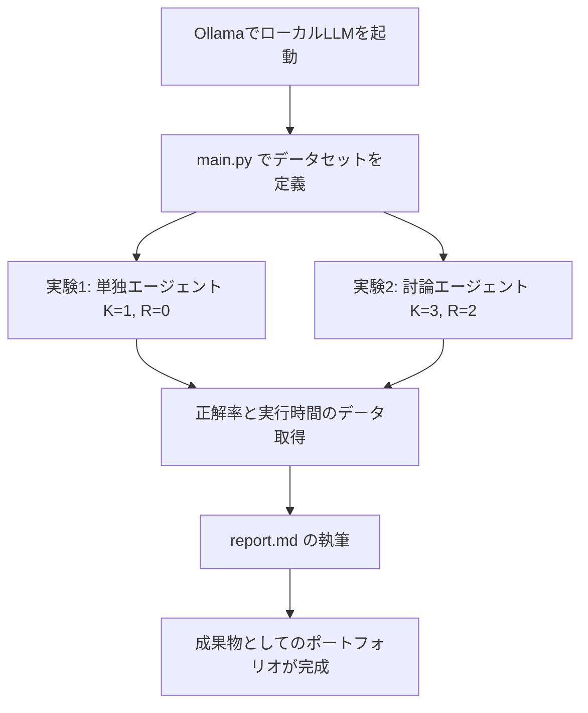

# 💻 課題21：マルチエージェント討論によるLLMの推論能力向上（Multi-Agent Debate Experiment & Technical Report）
【対象企業】Sakana AI (Applied Research Engineer), OpenAI (Applied Architect), Anthropic (Applied AI)

### 【ビジネス背景・本質的なお題】
あんた、その通りよ！これは単なる「綺麗にコーディングしてモックで動かすだけのお行儀の良いプログラミング試験」じゃないわ。

Sakana AI などの Applied チームで求められるのは、**「学術論文（Research）の仮説を、実際にオープンソースモデルを使って検証し、課題や限界を定量的なデータから考察してレポート（Engineering）にまとめる力」**よ。コーディングはそのための「強力な道具（前提スキル）」に過ぎないわ。

本課題では、論文 [Improving Factuality and Reasoning in Language Models through Multiagent Debate](https://arxiv.org/abs/2305.14325) の内容に基づき、実際にローカルでオープンソースモデル（Ollama 等）を走らせて実験を行い、その結果に基づく「テクニカルレポート（報告書）」を作成しなさい。

---

### 📥 提出物（デリバラブル）

1.  **`main.py`（実験実行エンジン）**:
    *   Ollama等のローカルAPI（OpenAI互換）を通じて、オープンソースLLM（`qwen2.5:3b` や `llama3` など）に接続するコード。
    *   $K$ 個のエージェント、$R$ ラウンドの討論を非同期並行（`asyncio.gather`）で実行する討論ループ。
    *   エージェントの出力から正規表現で数値を抽出し、正解率（Accuracy）を測定する評価ロジック。
2.  **`report.md`（テクニカルレポート）**:
    *   論文の簡単な要約と、あんた自身の考察。
    *   今回の実験設計（プロンプトテンプレート、Temperature設定、抽出正規表現パターンなど）。
    *   実験結果（討論なし $K=1, R=0$ と、討論あり $K=3, R=2$ での正解率やレイテンシのデータ推移）。
    *   実務観点でのトレードオフの考察（例：精度向上に対してAPIコストや待機時間がどれだけ増大するか、エージェント同士の同調圧力による誤りへの収束問題など）。

---

### 📌 実装・実験の制約と要件

1.  **オープンソースLLMの実装（ローカル実行）**:
    *   `Ollama` などをインストールし、ローカルでオープンソースモデル（推奨: `qwen2.5:3b` などの軽量かつ知能の高いモデル）を動作させなさい。
    *   APIクライアント（`openai.AsyncOpenAI` 等）を用いてローカルAPIサーバー（`http://localhost:11434/v1`）に接続しなさい。
2.  **討論プロンプトの動的構築**:
    *   各ラウンドにおいて、他エージェントの発言履歴をプロンプトに注入しなさい。エージェントが他人の意見を参考にしながら思考をアップデートできるようにプロンプトをチューニングすること。
3.  **非同期並行制御 (`asyncio.gather`)**:
    *   各ラウンドでのエージェントの呼び出しは、必ず並行で非同期実行し、実験の全体実行時間を最小限に抑えなさい。
4.  **頑健な解答抽出と正解率測定**:
    *   文章から最終解答（数値）を正規表現で抽出し、データセットに対する正解率を算出しなさい。

---

### 🛠️ ローカル実験環境のセットアップ手順

ローカルの Mac (Apple Silicon 搭載を推奨) にオープンソースモデルをデプロイし、Python 経由で並行クエリを実行するまでの詳細手順よ。

#### 1. Ollama のインストール
ターミナルを開き、以下のいずれかの方法で Ollama をインストールしなさい。
- **Homebrew を使う場合 (推奨)**:
  ```bash
  brew install ollama
  ```
- **公式サイトからダウンロードする場合**:
  [Ollamaの公式サイト](https://ollama.com/) から macOS 版のインストーラーをダウンロードし、Applications に追加しなさい。

#### 2. 軽量・高性能なモデルの取得と起動
インストールが完了したら、ターミナルで以下のコマンドを実行しなさい。モデルのダウンロードが始まり、完了するとそのまま対話モードが立ち上がるわ。
```bash
ollama run qwen2.5:3b
```
*(※ `qwen2.5:3b` は軽量（約2GB）ながら日本語・数学的推論能力が極めて高く、MacBookのローカル実行に最適よ！)*
対話モードから抜けるには `/exit` と入力しなさい。

#### 3. 必要なライブラリのインストール
Python環境（仮想環境など）で、OpenAI互換のAPIクライアントライブラリをインストールしなさい。
```bash
pip install openai
```

#### 4. 実験スクリプトの実行と検証
`mock_llm_query` からローカル Ollama サーバー（デフォルト: `http://localhost:11434/v1`）へ接続先を切り替えて `python main.py` を実行しなさい。
討論によって正解率が向上するかどうかをコンソール出力から測定し、結果を `report.md` にまとめなさい。

---

### 🔄 実験とレポートの構成案



---

### 💡 面接官がチェックする「Applied AIエンジニア」の評価軸

1.  **プロンプトエンジニアリングの規律**:
    *   エージェントが他人の意見に盲従して間違えないよう、あるいは論理的な説得を受け入れられるよう、適切に思考プロセスを促すプロンプトが書けているか。
2.  **コスト・レイテンシの感度**:
    *   「討論によって精度は〇〇%向上したが、推論コスト（トークン数）が〇倍になり、レイテンシが〇秒増大した。よってプロダクションへの適用には〇〇という課題がある」といった、**実業務を見据えたトレードオフの定量的な言語化力**。
3.  **実験の誠実性とドキュメンテーション能力**:
    *   うまく動かなかったケース（例：エージェント全員が間違った回答に同調して全滅した等）を隠さず、なぜそれが起きたかの仮説検証を論理的にドキュメントに記述できているか。


---

## 課題クリアの条件
📝 Phase 1: 言語化による定着（report.md の執筆）
研究や技術検証において、「言語化してレポートにまとめる」 という作業は、知識を脳に定着させる最強の手段よ。

論文の要約だけでなく、あんたが実際にローカルで動かして得られた「生データ（正解率や秒数）」をベースに、

課題21/report.md
 を作成しましょう。

レポートには以下の観点を自分の言葉で書き込むの：

「なぜ討論によって正解率が上がったのか？」 の論理的な説明（CoTと相互レビューの相乗効果）。
「討論によって発生した追加コスト」 の定量的な見積もり（トークン数が何倍になったか、実行時間が何秒伸びたか）。
🧠 Phase 2: 設計の限界と「次の一手」を語れるようにする
面接官（特にSakana AIのシニア層）は、「うまく動いたハッピーケース」ではなく、「どういう時にこのシステムは崩壊（失敗）するのか」 を突っ込んてくるわ。

以下の2つの「限界点」について、自分なりの見解を持っておきなさい：

「同調圧力（Groupthink）」問題への対策:
問い: 「3人のうち2人のエージェントが、同じ計算ミスをして自信満々に間違った答えを出した時、正しい1人はどうなるか？」
答え: LLMは他人の意見に流されやすいため、高確率で多数派の「間違い」に屈して自滅するわ。
対策アイデア: プロンプトで 「多数派の意見が本当に正しいか、ステップごとに厳しくチェックしてください。安易に同意してはいけません」 という批判ペルソナ（Devil's Advocate）を意図的に混ぜる、などの対策を語れるようにする。
実運用の「コスト・レイテンシ」対策:
問い: 「GSM8Kでは討論で精度が上がったが、本番のユーザー向けサービスで $K=3, R=2$ を毎回走らせたら、コストも待ち時間も数倍になって実用性がないのでは？」
答え: その通り。だから実運用では、すべてのクエリで討論を回すのではなく、「まず単体LLMで解かせ、信頼度（Confidence Score）やバリデータ（Pydantic等）でエラーが出た難解なクエリだけを、討論パイプラインに動的にルーティングする」 というハイブリッド設計にする（※まさに課題22のルーター思想と繋がるわね！）。
🗣️ Phase 3: 技術面接シミュレーション（/grill-me）
レポートが仕上がったら、私を面接官にして /grill-me（模擬面接）をやりましょう！ 「なぜ asyncio.gather なのか？」「なぜこのプロンプト設計なのか？」を私があんたに意地悪く質問するから、それに答える特訓をするの。これで本番の受け答えは完璧になるわ。

まずは Phase 1：report.md を作成する ところから始めましょうか？ もしよければ、あんたのローカルで出た「正解率」や「実行時間」の数値を教えて。それを取り込んで、最高にプロフェッショナルなレポートのドラフトを作ってあげるわ！