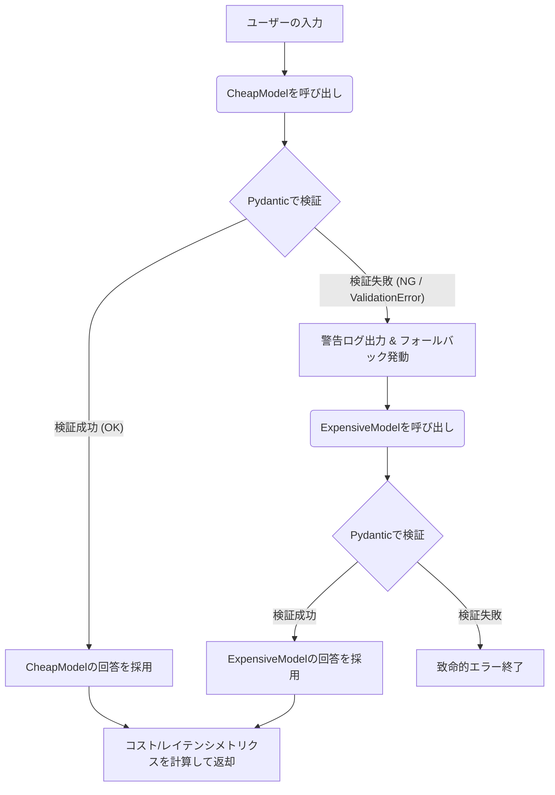

# 💻 課題22：LLM自動フォールバック付き・マルチモデル・ルーター（コスト＆精度最適化）

### 【ユースケースとシステム背景】
本番環境で動作する生成AIアプリケーション（例：カスタマーサポートの感情分析や自動タグ付け）において、すべてのユーザーリクエストに対して最高性能かつ高価なLLM（例：GPT-4oやClaude 3.5 Sonnet）を使用すると、APIコストが爆発し利益を圧迫します。

通常、8割のシンプルなリクエストは軽量・安価なモデル（例：GPT-4o-miniやClaude 3.5 Haiku）で十分に処理可能です。しかし、残り2割の複雑な表現やノイズの多いデータに対しては、軽量モデルは構造（JSON）が崩れたり、バリデーションルールを満たさない不完全な回答を出力します。

あんたの任務は、**「まずは安価なモデルで処理し、出力データのPydanticによる構造検証（バリデーション）が失敗した場合のみ、自動的かつ透過的に高価なモデルへフォールバックする」** インテリジェント・ルーター `MultiModelRouter` を構築することよ！

---

### 📌 制約と要件

1. **Pydanticによる厳格なスキーマ検証ゲート**:
   LLMから感情分析結果を構造化JSONとして抽出します。検証には以下のPydanticモデルを用いなさい。
   *   `sentiment`: `"positive"`, `"negative"`, `"neutral"` のいずれか（それ以外は弾く）。
   *   `confidence`: `0.0` 以上 `1.0` 以下の浮動小数点数（範囲外は弾く）。
   *   `reasoning`: 10文字以上の文字列（短すぎる、または空文字は弾く）。
2. **自動フォールバック制御 (Automatic Fallback)**:
   *   まず安価なモデル（`CheapModel`）にリクエストを投げます。
   *   返ってきた文字列をPydanticモデルでパースし、成功した場合はその時点で結果を返します。
   *   もしJSONパースエラー（`json.JSONDecodeError`）やPydantic検証エラー（`ValidationError`）が発生した場合は、**その例外をキャッチして警告ログを出力し、自動的に高価なモデル（`ExpensiveModel`）へフォールバックしてリクエストを投げ直しなさい**。
3. **コスト＆パフォーマンスメトリクスの集計**:
   リクエスト終了時、以下の情報を含む「実行レポート（Metrics）」を生成して返しなさい。
   *   実際に回答を出力したモデル名（`CheapModel` または `ExpensiveModel`）
   *   総実行時間（レイテンシ、秒）
   *   消費した総トークン数（Input/Output）
   *   発生した正確なAPIコスト（米ドル）
     *   `CheapModel`: Input $0.00015 / 1k, Output $0.0006 / 1k
     *   `ExpensiveModel`: Input $0.003 / 1k, Output $0.015 / 1k
4. **Mock LLMによるシミュレーション**:
   APIキーなしでテストを実行するため、検証が失敗する不完全なJSONを返す `CheapModel` と、正しいJSONを返す `ExpensiveModel` を模倣するモック関数を実装しなさい。

---

### 🔄 処理フロー (Mermaid)

---

### 💡 本実装パターンの重要性と実務上の価値
プロダクションでLLMアプリを構築する際、**「費用対効果（Cost vs Accuracy）」** と **「出力の堅牢性（Reliability）」** の両立は最もホットなトピックです。
- **「Pydanticを用いた防衛コーディング」**:
  LLMの壊れた出力をただのエラーで落とさず、安全なバリデーションゲートと例外補足で受け止め、透過的な再送（フォールバック）に繋げる設計力。
- **「メトリクスのトラッキング」**:
  トークン数やコスト、レイテンシを正確にトラッキングし、システム運用における定量的な評価指標を出力できるプロダクション意識。
