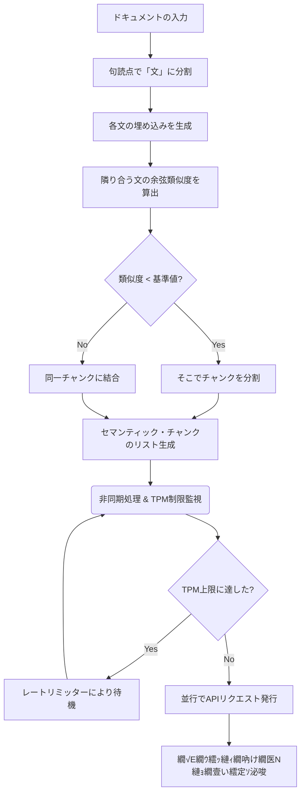

# �捗 隱ｲ鬘�23�壹そ繝槭Φ繝�ぅ繝�け繝ｻ繝√Ε繝ｳ繧ｭ繝ｳ繧ｰ縺ｨ繝ｬ繝ｼ繝医Μ繝溘ャ繝亥宛蠕｡莉倥″荳ｦ陦悟沂繧∬ｾｼ縺ｿ逕滓���AG繧､繝ｳ繧ｸ繧ｧ繧ｹ繝茨ｼ�

### 縲舌Θ繝ｼ繧ｹ繧ｱ繝ｼ繧ｹ縺ｨ繧ｷ繧ｹ繝�Β閭梧勹縲�
RAG�域､懃ｴ｢諡｡蠑ｵ逕滓��峨�繝��繧ｿ繝代う繝励Λ繧､繝ｳ縺ｫ縺翫＞縺ｦ縲∝�蜉帙ユ繧ｭ繧ｹ繝医ｒ蜊倡ｴ斐↑譁�ｭ玲焚�井ｾ具ｼ�500蟄励＃縺ｨ�峨〒蛹ｺ蛻�ｋ縲悟崋螳夐聞繝√Ε繝ｳ繧ｭ繝ｳ繧ｰ縲阪�縲∵枚遶�縺ｮ諢丞袖逧�↑蛹ｺ蛻�ｊ繧堤┌隕悶☆繧九◆繧∵､懃ｴ｢邊ｾ蠎ｦ繧定送縺励￥謔ｪ蛹悶＆縺帙∪縺吶€�

縺昴％縺ｧ縲�團繧雁粋縺�枚遶�縺ｮ縲梧э蜻ｳ縺ｮ鬘樔ｼｼ蠎ｦ�医さ繧ｵ繧､繝ｳ鬘樔ｼｼ蠎ｦ�峨€阪ｒ險育ｮ励＠縲�｡樔ｼｼ蠎ｦ縺梧€･關ｽ縺吶ｋ邂�園�郁ｰｷ�峨〒閾ｪ蜍慕噪縺ｫ蛻�牡縺吶ｋ**縲後そ繝槭Φ繝�ぅ繝�け繝ｻ繝√Ε繝ｳ繧ｭ繝ｳ繧ｰ縲�**縺檎樟蝨ｨ縺ｮ繝�ヵ繧｡繧ｯ繝医せ繧ｿ繝ｳ繝€繝ｼ繝峨〒縺吶€�

縺ｾ縺溘€∝�蜑ｲ縺励◆螟ｧ驥上�繝√Ε繝ｳ繧ｯ縺ｫ蟇ｾ縺励※繝吶け繝医Ν蝓九ａ霎ｼ縺ｿ��mbeddings�峨ｒ逕滓�縺吶ｋ髫帙€、PI縺ｮ譛€螟ｧ繝ｬ繝ｼ繝亥宛髯撰ｼ井ｾ具ｼ�1蛻�俣縺ｫ譛€螟ｧ 10,000 繝医�繧ｯ繝ｳ縺ｾ縺ｧ�峨ｒ閠��縺励↑縺代ｌ縺ｰ縲∝､ｧ驥上Μ繧ｯ繧ｨ繧ｹ繝医↓繧医ｋ **HTTP 429 (Too Many Requests)** 繧ｨ繝ｩ繝ｼ縺ｧ繝��繧ｿ騾｣謳ｺ繧ｸ繝ｧ繝悶′騾比ｸｭ縺ｧ繧ｯ繝ｩ繝�す繝･縺励※縺励∪縺�∪縺吶€�

縺ゅｓ縺溘�莉ｻ蜍吶�縲�**縲娯蔵鬘樔ｼｼ蠎ｦ險育ｮ励↓蝓ｺ縺･縺上そ繝槭Φ繝�ぅ繝�け繝ｻ繝√Ε繝ｳ繧ｭ繝ｳ繧ｰ縲�** 繧定｡後＞縲√＆繧峨↓ **縲娯贈繝医�繧ｯ繝ｳ繝ｬ繝ｼ繝亥宛髯撰ｼ�PM�峨ｒ閠��縺励※荳ｦ陦悟�逅�ｼ�syncio�峨〒蝓九ａ霎ｼ縺ｿ繧帝ｫ倬€溽函謌舌☆繧九€�** 繝ｭ繝舌せ繝医↑繧､繝ｳ繧ｸ繧ｧ繧ｹ繝医お繝ｳ繧ｸ繝ｳ `SemanticRAGPipeline` 繧呈ｧ狗ｯ峨☆繧九％縺ｨ繧茨ｼ�

---

### �東 蛻ｶ邏�→隕∽ｻｶ

1. **繧ｳ繧ｵ繧､繝ｳ鬘樔ｼｼ蠎ｦ縺ｫ蝓ｺ縺･縺上そ繝槭Φ繝�ぅ繝�け繝ｻ繝√Ε繝ｳ繧ｭ繝ｳ繧ｰ**:
   *   蜈･蜉帶枚遶�繧偵€悟唱轤ｹ�医€ゅｄ.�峨€阪〒譁�ｼ�entences�峨↓蛻�ｧ｣縺励∪縺吶€�
   *   蜷�枚縺ｮ蝓九ａ霎ｼ縺ｿ繝吶け繝医Ν繧貞叙蠕励＠縲�團繧雁粋縺�枚縺ｩ縺�＠縺ｮ**繧ｳ繧ｵ繧､繝ｳ鬘樔ｼｼ蠎ｦ��osine Similarity��**繧定ｨ育ｮ励＠縺ｪ縺輔＞縲�
       *   繧ｳ繧ｵ繧､繝ｳ鬘樔ｼｼ蠎ｦ: $Similarity(u, v) = \frac{u \cdot v}{\|u\| \|v\|}$
   *   鬘樔ｼｼ蠎ｦ縺後＠縺阪＞蛟､�井ｾ具ｼ啻0.7`�画悴貅€縺ｫ縺ｪ縺｣縺溷｢�阜繧偵€梧枚閼医�蛻�ｌ逶ｮ縲阪→蛻､螳壹＠縲√ユ繧ｭ繧ｹ繝医ｒ隍�焚縺ｮ繧ｻ繝槭Φ繝�ぅ繝�け繝ｻ繝√Ε繝ｳ繧ｯ縺ｫ蛻�牡縺励↑縺輔＞縲�
2. **髱槫酔譛溘°縺､荳ｦ陦後↑蝓九ａ霎ｼ縺ｿ逕滓�縺ｨ繝ｬ繝ｼ繝医Μ繝溘ャ繝亥宛蠕｡��oken Rate Limiter��**:
   *   逕滓�縺励◆繝√Ε繝ｳ繧ｯ縺ｮ繝ｪ繧ｹ繝医↓蟇ｾ縺励€�撼蜷梧悄��async`�峨〒荳€譁峨↓蝓九ａ霎ｼ縺ｿ繝吶け繝医Ν��mbeddings�峨ｒ逕滓�縺励↑縺輔＞縲�
   *   縺溘□縺励€�1蛻�俣縺ｫ騾∽ｿ｡縺ｧ縺阪ｋ繝医�繧ｯ繝ｳ謨ｰ��PM: Tokens Per Minute�峨�荳企剞蛟､ `max_tpm` 繧貞宍譬ｼ縺ｫ驕ｵ螳医＠縺ｪ縺輔＞縲�
   *   縺薙ｌ繧貞ｮ溽樟縺吶ｋ縺溘ａ縲�**繝医�繧ｯ繝ｳ繝舌こ繝�ヨ繧｢繝ｫ繧ｴ繝ｪ繧ｺ繝�**縺ｾ縺溘�繧ｻ繝槭ヵ繧ｩ繧堤畑縺�※縲∽ｸｦ陦後Μ繧ｯ繧ｨ繧ｹ繝井ｸｭ縺ｫ邏ｯ遨埼€∽ｿ｡繝医�繧ｯ繝ｳ謨ｰ縺� `max_tpm` 繧定ｶ�∴縺ｪ縺�ｈ縺��蜍輔〒豬�㍼隱ｿ謨ｴ�亥ｾ�ｩ溘�繝悶Ο繝�け�峨ｒ縺九￠繧九Ξ繝ｼ繝亥宛髯舌Ο繧ｸ繝�け繧貞ｮ溯｣�＠縺ｪ縺輔＞縲�
3. **Mock Embedding API**:
   *   譛ｬ逡ｪAPI縺ｪ縺励〒繝ｭ繝ｼ繧ｫ繝ｫ讀懆ｨｼ縺後〒縺阪ｋ繧医≧縲∵枚縺ｮ諢丞袖縺ｫ蠢懊§縺溽桝莨ｼ繝吶け繝医Ν�域ｬ｡蜈�焚 3 遞句ｺｦ縺ｮ邁｡譏薙�繧ｯ繝医Ν�峨ｒ霑斐＠縲∵ｶ郁ｲｻ繝医�繧ｯ繝ｳ謨ｰ繧りｨ育ｮ励☆繧� `mock_embedding_api` 繧貞茜逕ｨ縺励↑縺輔＞縲�

---

### �売 蜃ｦ逅�ヵ繝ｭ繝ｼ



---

### �庁 譛ｬ螳溯｣�ヱ繧ｿ繝ｼ繝ｳ縺ｮ驥崎ｦ∵€ｧ縺ｨ螳溷漁荳翫�萓｡蛟､
*   **縲後い繝ｫ繧ｴ繝ｪ繧ｺ繝�縺ｨ繧､繝ｳ繝輔Λ蛻ｶ蠕｡縺ｮ陞榊粋縲�**:
    蜊倥↓RAG繝輔Ξ繝ｼ繝�繝ｯ繝ｼ繧ｯ��lamaIndex遲会ｼ峨ｒ蜻ｼ縺ｳ蜃ｺ縺吶□縺代〒縺ｪ縺上€√メ繝｣繝ｳ繧ｭ繝ｳ繧ｰ縺ｮ謨ｰ蟄ｦ逧�Ο繧ｸ繝�け�磯｡樔ｼｼ蠎ｦ�峨→縲√ロ繝�ヨ繝ｯ繝ｼ繧ｯI/O縺ｮ迚ｩ逅�噪蛻ｶ髯撰ｼ�PI繝ｬ繝ｼ繝亥宛髯撰ｼ峨ｒ閾ｪ蛻�〒螳溯｣��蛻ｶ蠕｡縺怜�繧九€悟ｼ輔″蜃ｺ縺励�螟壹＆縲阪ｒ遉ｺ縺帙ｋ轤ｹ縲�
*   **縲悟ｮ溽畑逧�ヰ繝ｼ繧ｹ繝亥宛蠕｡縲�**:
    螟ｧ螳ｹ驥上ョ繝ｼ繧ｿ繧奪WH��nowflake遲会ｼ峨ｄ繝吶け繝医ΝDB縺ｫ遘ｻ陦後☆繧矩圀縺ｮ縲御ｿ｡鬆ｼ諤ｧ縺ｨ蜃ｦ逅�€溷ｺｦ縺ｮ繝医Ξ繝ｼ繝峨が繝輔€阪ｒ縲√さ繝ｼ繝峨Ξ繝吶Ν縺ｧ繧ｳ繝ｳ繝医Ο繝ｼ繝ｫ縺ｧ縺阪ｋ閭ｽ蜉帙€�

---

### �ｧ� 險ｭ險域€晄Φ�壹け繝ｩ繧ｹ險ｭ險医→迥ｶ諷狗ｮ｡逅��驥崎ｦ∵€ｧ�医ユ繧､繧ｯ繝帙�繝�隱ｲ鬘後�謚€陦馴擇隲�ｯｾ遲厄ｼ�

譛ｬ繧ｷ繧ｹ繝�Β縺ｯ `AsyncTokenBucket` 縺ｨ `SemanticRAGPipeline` 縺ｮ2縺､繧偵け繝ｩ繧ｹ縺ｨ縺励※險ｭ險医＠縺ｦ縺�ｋ繧上€る未謨ｰ縺ｧ螳溯｣�☆繧九�縺ｨ豈碑ｼ�＠縺滄圀縺ｮ繝｡繝ｪ繝�ヨ縺ｨ縲√い繝ｼ繧ｭ繝�け繝√Ε險ｭ險井ｸ翫�諢冗ｾｩ繧呈紛逅�＠縺ｦ縺翫＞### �嶋 譛ｬ螳溯｣��髯千阜縺ｨ縲∫ｲｾ蠎ｦ繧貞髄荳翫＆縺帙ｋ譛ｬ逡ｪ蜷代￠縺ｮ繧｢繝励Ο繝ｼ繝�ｼ磯擇隲�い繝斐�繝ｫ逕ｨ��

莉雁屓縺ｮ蝗ｺ螳壹＠縺阪＞蛟､�井ｾ具ｼ啻0.7`�峨ｒ逕ｨ縺�◆繧ｻ繝槭Φ繝�ぅ繝�け繝ｻ繝√Ε繝ｳ繧ｭ繝ｳ繧ｰ縺ｫ縺ｯ縲∵枚閼医′郢九′縺｣縺ｦ縺�※繧る｡樔ｼｼ蠎ｦ縺後ｏ縺壹°縺ｫ荳句屓繧九→蛻�牡縺輔ｌ縺ｦ縺励∪縺�€碁℃蛻�牡�亥�霆翫�逶ｸ蟇ｾ騾溷ｺｦ縺ｮ萓九↑縺ｩ�峨€阪�髯千阜縺後≠繧翫∪縺吶€�
譛ｬ逡ｪ縺ｮRAG繧ｷ繧ｹ繝�Β讒狗ｯ峨↓縺翫＞縺ｦ縲√％繧後ｒ隗｣豎ｺ縺励※讀懃ｴ｢邊ｾ蠎ｦ繧呈怙螟ｧ蛹悶☆繧九◆繧√�3縺､縺ｮ鬮伜ｺｦ縺ｪ繧｢繝励Ο繝ｼ繝√ｒ莉･荳九↓縺ｾ縺ｨ繧√∪縺励◆縲�

#### 竭� 繧ｹ繝ｩ繧､繝�ぅ繝ｳ繧ｰ繧ｦ繧｣繝ｳ繝峨え�亥燕蠕梧枚閼医�邨仙粋蛻､螳夲ｼ�
*   **繧｢繝励Ο繝ｼ繝�**: 蜊倅ｸ€縺ｮ譁�酔螢ｫ繧呈ｯ碑ｼ�☆繧九�縺ｧ縺ｯ縺ｪ縺上€∝｢�阜邱壹�縲悟ｷｦ蛛ｴ $N$ 譁�€阪→縲悟承蛛ｴ $N$ 譁�€阪�蟷ｳ蝮��繧ｯ繝医Ν蜷悟｣ｫ繧呈ｯ碑ｼ�☆繧九€�
*   **繝｡繝ｪ繝�ヨ**: 迚ｹ螳壹�蜊倩ｪ槭ｄ陦ｨ迴ｾ縺ｮ謠ｺ繧後↓繧医ｋ繧ｳ繧ｵ繧､繝ｳ鬘樔ｼｼ蠎ｦ縺ｮ遯∫匱逧�↑菴惹ｸ具ｼ医ヮ繧､繧ｺ�峨ｒ蜷ｸ蜿弱＠縲∵枚遶�蜈ｨ菴薙�邱ｩ繧�°縺ｪ諢丞袖縺ｮ驕ｷ遘ｻ縺�縺代ｒ豁｣遒ｺ縺ｫ謐峨∴繧峨ｌ繧九€�
*   **蜈ｷ菴謎ｾ�**:
    *   `S1: 繝ｪ繝ｳ繧ｴ縺ｯ蛛･蠎ｷ縺ｫ濶ｯ縺�€Ａ
    *   `S2: 譁ｰ蟷ｹ邱壹�荳ｭ縺ｧ鬟溘∋繧九Μ繝ｳ繧ｴ縺ｯ鄒主袖縺励＞縲Ａ (竊� 髮ｻ霆翫→縺�≧繝弱う繧ｺ縺梧ｷｷ縺悶▲縺�)
    *   `S3: 迚ｹ縺ｫ繝薙ち繝溘Φ縺瑚ｱ雁ｯ後□縲Ａ
    *   `S4: 繝輔Ν繝ｼ繝��豈取律鬟溘∋縺溘⊇縺�′縺�＞縲Ａ
    *   **1譁�★縺､��2 vs S3�峨〒豈碑ｼ�＠縺溷�ｴ蜷�**: 蜊倩ｪ槭€梧眠蟷ｹ邱壹€阪↓蠑輔▲蠑ｵ繧峨ｌ縺ｦ鬘樔ｼｼ蠎ｦ縺梧€･關ｽ縺励€∬ｪ､縺｣縺ｦ蛻�牡�磯℃蛻�牡�峨＆繧後※縺励∪縺�€�
    *   **繧ｹ繝ｩ繧､繝�ぅ繝ｳ繧ｰ繧ｦ繧｣繝ｳ繝峨え�育ｪ灘ｹ� $N=2$�峨�蝣ｴ蜷�**: `[S1, S2]`�域棡迚ｩ�句�霆翫ヮ繧､繧ｺ�峨�蟷ｳ蝮��繧ｯ繝医Ν縺ｨ縲～[S3, S4]`�域棡迚ｩ�峨�蟷ｳ蝮��繧ｯ繝医Ν繧呈ｯ碑ｼ�☆繧九€ゅげ繝ｫ繝ｼ繝怜�菴薙�諢丞袖縺後€梧棡迚ｩ縲阪〒邨ｱ荳€縺輔ｌ縺ｦ縺�ｋ縺溘ａ縲�｡樔ｼｼ蠎ｦ縺ｯ鬮倥＞迥ｶ諷具ｼ井ｾ�: `0.75`�峨ｒ邯ｭ謖√〒縺阪€∬ｪ､蛻�牡繧帝亟縺偵ｋ縲�
*   **繝医Ξ繝ｼ繝峨が繝� (蠅�阜縺ｮ繝懊こ/繧ｪ繝ｼ繝舌�繧ｹ繝�繝ｼ繧ｸ繝ｳ繧ｰ)**:
    遯灘ｹ� $N$ 繧貞､ｧ縺阪￥縺励☆縺弱ｋ縺ｨ縲∝｢�阜繧定ｷｨ縺�□蛻･縺ｮ繝医ヴ繝�け�井ｾ�: 蛻苓ｻ翫°繧峨ョ繝ｼ繧ｿ繝吶�繧ｹ縺ｸ縺ｮ驕ｷ遘ｻ�峨′遯灘�縺ｮ蟷ｳ蝮�喧蜃ｦ逅�↓繧医▲縺ｦ繝懊Ζ縺代※縺励∪縺�€√ヨ繝斐ャ繧ｯ縺ｮ蛻�ｊ譖ｿ繧上ｊ縺ｧ蛻�牡縺輔ｌ縺ｪ縺上↑繧具ｼ亥�蜑ｲ貍上ｌ�峨€ゅ◎縺ｮ縺溘ａ縲�€壼ｸｸ $N = 2$ 縺ｾ縺溘� $3$ 遞句ｺｦ縺ｮ蟆上＆縺�€､縺後�繧ｹ繝医�繝ｩ繧ｯ繝�ぅ繧ｹ縺ｨ縺ｪ繧九€�

#### 竭｡ 蜍慕噪縺励″縺�€､�医ヱ繝ｼ繧ｻ繝ｳ繧ｿ繧､繝ｫ蜍ｾ驟榊�蜑ｲ��
*   **繧｢繝励Ο繝ｼ繝�**: 繝峨く繝･繝｡繝ｳ繝亥�菴薙�縲碁團謗･譁��鬘樔ｼｼ蠎ｦ縲阪�蟾ｮ蛻�ｼ亥鏡驟搾ｼ峨ｒ險育ｮ励＠縲∽ｸ九′繧雁ｹ�′鬘戊送縺ｪ邂�園�井ｾ�: 荳倶ｽ�20%縺ｮ諤･關ｽ繝昴う繝ｳ繝茨ｼ峨□縺代〒蜍慕噪縺ｫ蛻�ｋ縲�
*   **繝｡繝ｪ繝�ヨ**: 繝峨く繝･繝｡繝ｳ繝医�譁�ｫ�驥上ｄ縲∽ｽｿ逕ｨ縺吶ｋEmbedding繝｢繝�Ν縺ｮ諤ｧ雉ｪ�亥�菴鍋噪縺ｫ繧ｹ繧ｳ繧｢縺御ｽ弱ａ縺ｫ蜃ｺ繧�☆縺�Δ繝�Ν縺ｪ縺ｩ�峨↓蟾ｦ蜿ｳ縺輔ｌ縺壹€∫悄縺ｫ繧ｳ繝ｳ繝�く繧ｹ繝医′螟牙喧縺励◆蠅�阜邱壹□縺代〒蛻�牡縺ｧ縺阪ｋ縲�
*   **蜈ｷ菴謎ｾ�**:
    *   蟆る摩逕ｨ隱槭′螟壹￥縲√Δ繝�Ν縺悟�菴鍋噪縺ｫ菴弱＞鬘樔ｼｼ蠎ｦ縺励°蜃ｺ蜉帙＠縺ｪ縺�屮隗｣縺ｪ繝峨く繝･繝｡繝ｳ繝医↓縺翫＞縺ｦ縲�｡樔ｼｼ蠎ｦ繝ｪ繧ｹ繝医′ `[0.65, 0.60, 0.30, 0.62]` 縺ｮ繧医≧縺ｫ縺ｪ縺｣縺溘→縺吶ｋ縲�
    *   **蝗ｺ螳壹＠縺阪＞蛟､ `0.7` 縺ｮ蝣ｴ蜷�**: 縺吶∋縺ｦ縺後＠縺阪＞蛟､譛ｪ貅€縺ｨ縺ｪ繧九◆繧√€∝�譁�ｫ�縺�1譁�★縺､繝舌Λ繝舌Λ縺ｫ邏ｰ蛻�ｌ縺ｫ縺輔ｌ縺ｦ縺励∪縺�€�
    *   **蜍慕噪縺励″縺�€､�井ｸ九′繧雁ｹ��諤･關ｽ讀懷��峨�蝣ｴ蜷�**: 蜷�團謗･蛟､縺ｮ蟾ｮ蛻�ｼ�0.65 筐� 0.60` [蟾ｮ-0.05]縲～0.60 筐� 0.30` [蟾ｮ-0.30]縲～0.30 筐� 0.62` [蟾ｮ+0.32]�峨ｒ逶｣隕悶＠縲∵怙繧り誠蟾ｮ縺ｮ豼€縺励＞ `-0.30` 縺ｮ螟牙喧轤ｹ��2 縺ｨ S3 縺ｮ髢難ｼ峨�縺ｿ繧呈､懷�縺励※繧ｫ繝�ヨ縺吶ｋ縲�

#### 竭｢ 隕ｪ蟄舌メ繝｣繝ｳ繧ｭ繝ｳ繧ｰ��arent-Child / Sentence Window Retrieval��
*   **繧｢繝励Ο繝ｼ繝�**: 繝吶け繧ｿ繝ｼDB縺ｫ縺ｯ讀懃ｴ｢縺ｫ縺九°繧翫ｄ縺吶＞繧医≧縺ｫ邏ｰ縺九￥蛻�▲縺溘€悟ｭ舌メ繝｣繝ｳ繧ｯ縲阪ｒ繧､繝ｳ繝�ャ繧ｯ繧ｹ縺励※讀懃ｴ｢縺輔○縲´LM縺ｫ貂｡縺吶さ繝ｳ繝�く繧ｹ繝医→縺励※縺ｯ縲√ヲ繝�ヨ縺励◆蟄舌メ繝｣繝ｳ繧ｯ縺ｮ蜻ｨ蝗ｲ縺ｮ譁�ц繧ょ性繧√◆蠎�＞縲瑚ｦｪ繝√Ε繝ｳ繧ｯ縲阪ｒ蠕ｩ蜈�＠縺ｦ貂｡縺吶€�
*   **繝｡繝ｪ繝�ヨ**: 讀懃ｴ｢邊ｾ蠎ｦ��ecall�峨ｒ鬮倥ａ縺､縺､縲´LM縺ｸ蜊∝�縺ｪ繧ｳ繝ｳ繝�く繧ｹ繝医ｒ貂｡縺吶％縺ｨ縺ｧ繝上Ν繧ｷ繝阪�繧ｷ繝ｧ繝ｳ繧呈･ｵ蟆丞喧縺吶ｋ縲√�繝ｭ繝€繧ｯ繧ｷ繝ｧ繝ｳRAG縺ｫ縺翫￠繧九ｂ縺｣縺ｨ繧ょｼｷ蜉帙↑繝励Λ繧ｯ繝�ぅ繧ｹ縺ｮ荳€縺､縲�
*   **蜈ｷ菴謎ｾ�**:
    *   遉ｾ蜀�∈閠��繝九Η繧｢繝ｫ縺九ｉ縲後ユ繧､繧ｯ繝帙�繝�隱ｲ鬘後�蛻ｶ髯先凾髢薙€阪ｒ讀懃ｴ｢縺励◆縺��ｴ蜷医€�
    *   **蟄舌メ繝｣繝ｳ繧ｯ�医う繝ｳ繝�ャ繧ｯ繧ｹ逕ｨ��**: `縲御ｸ€谺｡驕ｸ閠�〒縺ｯ繝�う繧ｯ繝帙�繝�隱ｲ鬘後′隱ｲ縺輔ｌ縺ｾ縺吶€ゅ€港�育洒譁��縺溘ａ縲√Θ繝ｼ繧ｶ繝ｼ縺ｮ繧ｯ繧ｨ繝ｪ縲後ユ繧､繧ｯ繝帙�繝�隱ｲ鬘後�譛滄俣縺ｯ�溘€阪→繧ｳ繧ｵ繧､繝ｳ鬘樔ｼｼ蠎ｦ縺碁ｫ倥￥縺ｪ繧翫ｄ縺吶￥縲∵､懃ｴ｢縺ｫ繝偵ャ繝医＠繧�☆縺�ｼ�
    *   **隕ｪ繝√Ε繝ｳ繧ｯ��LM蜈･蜉帷畑��**: `縲御ｸ€谺｡驕ｸ閠�〒縺ｯ繝�う繧ｯ繝帙�繝�隱ｲ鬘後′隱ｲ縺輔ｌ縺ｾ縺吶€よ悄髢薙�謨ｰ騾ｱ髢薙〒縲∝ｮ溯｣��豁｣遒ｺ縺輔□縺代〒縺ｪ縺蹴EADME縺ｫ譖ｸ縺九ｌ縺溯ｨｭ險亥愛譁ｭ縺碁㍾隕悶＆繧後∪縺吶€ゅ◎縺ｮ蠕後€∵署蜃ｺ繧ｳ繝ｼ繝峨ｒ蜈�↓縺励◆繝�ぅ繧ｹ繧ｫ繝�す繝ｧ繝ｳ髱｢謗･縺後≠繧翫∪縺吶€ゅ€港
    *   **螳溯｡後ヵ繝ｭ繝ｼ**: 繧ｯ繧ｨ繝ｪ縺後€悟ｭ舌メ繝｣繝ｳ繧ｯ縲阪↓繝偵ャ繝医☆繧九→縲√す繧ｹ繝�Β縺ｯ陬丞�縺ｧ縺昴�蟄舌↓髢｢騾｣莉倥￠繧峨ｌ縺ｦ縺�ｋ縲瑚ｦｪ繝√Ε繝ｳ繧ｯ縲阪ｒ繝��繧ｿ繝吶�繧ｹ縺九ｉ蠑輔″蜃ｺ縺励€´LM縺ｮ繝励Ο繝ｳ繝励ヨ縺ｸ豕ｨ蜈･縺吶ｋ縲ゅ％繧後↓繧医ｊLLM縺ｯ縲梧悄髢薙�謨ｰ騾ｱ髢薙€阪→縺�≧蠢�ｦ√↑譁�ц繧貞性繧薙□豁｣遒ｺ縺ｪ蝗樒ｭ斐ｒ逕滓�縺ｧ縺阪ｋ縲ｊ縺ｮ謔ｲ蜉�ｼ医Ξ繝ｼ繧ｹ繧ｳ繝ｳ繝�ぅ繧ｷ繝ｧ繝ｳ�峨€阪′逋ｺ逕溘＠縺ｾ縺吶€�
    迥ｶ諷九→縲√◎縺ｮ螟画峩繝｡繧ｽ繝�ラ��consume`�峨ｒ繧ｯ繝ｩ繧ｹ縺ｮ蠅�阜蜀�↓繧ｫ繝励そ繝ｫ蛹悶＠縲～asyncio.Lock` 縺ｧ蜷梧悄蛻ｶ蠕｡縺吶ｋ縺薙→縺ｧ螳牙�縺ｪ荳ｦ陦悟�逅�ｒ菫晁ｨｼ縺励※縺�ｋ縺ｮ繧医€�

```mermaid
flowchart TD
    %% 蜈ｱ騾壹�繧ｹ繧ｿ繧､繝ｫ螳夂ｾｩ
    classDef badState fill:#ffeef0,stroke:#ff8080,stroke-width:2px,color:#333;
    classDef goodState fill:#e6fcf5,stroke:#20c997,stroke-width:2px,color:#333;
    classDef task fill:#f1f3f5,stroke:#adb5bd,stroke-width:1px,color:#495057;

    subgraph Bad ["笶� 髢｢謨ｰ險ｭ險茨ｼ育憾諷九�髴ｲ蜃ｺ縺ｨ繝ｬ繝ｼ繧ｹ繧ｳ繝ｳ繝�ぅ繧ｷ繝ｧ繝ｳ��"]
        direction TB
        T1["Task 1 (process_chunk)"]:::task
        T2["Task 2 (process_chunk)"]:::task
        T3["Task 3 (process_chunk)"]:::task
        
        GlobalState["�倹 繧ｰ繝ｭ繝ｼ繝舌Ν螟画焚 / 蠑墓焚縺ｮ蜈ｱ譛芽ｾ樊嶌\n{ 'tokens': 10, 'last_update': 1718000 }"]:::badState
        
        T1 -->|縲悟酔譎ゅ↓縲崎ｪｭ縺ｿ譖ｸ縺鋼 GlobalState
        T2 -->|縲悟酔譎ゅ↓縲崎ｪｭ縺ｿ譖ｸ縺鋼 GlobalState
        T3 -->|縲悟酔譎ゅ↓縲崎ｪｭ縺ｿ譖ｸ縺鋼 GlobalState
        
        Conflict["�圷 隱ｰ縺後＞縺､譖ｴ譁ｰ縺励◆縺句�縺九ｉ縺ｪ縺上↑繧浬n險育ｮ励′遶ｶ蜷医＠縺ｦ繧ｯ繝ｩ繝�す繝･繝ｻ荳企剞遯∫�ｴ縺吶ｋ"]
        GlobalState -.-> Conflict
    end

    subgraph Good ["箝包ｸ� 繧ｯ繝ｩ繧ｹ險ｭ險茨ｼ育憾諷九�繧ｫ繝励そ繝ｫ蛹悶→螳牙�縺ｪ荳ｦ陦悟宛蠕｡��"]
        direction TB
        T1_G["Task 1 (process_chunk)"]:::task
        T2_G["Task 2 (process_chunk)"]:::task
        T3_G["Task 3 (process_chunk)"]:::task

        subgraph ClassBoundary ["AsyncTokenBucket 繧､繝ｳ繧ｹ繧ｿ繝ｳ繧ｹ (繧ｫ繝励そ繝ｫ蛹悶�螢�)"]
            direction TB
            Lock["�白 asyncio.Lock (鬆�分蠕�■縺ｮ蛻ｶ蠕｡)"]
            
            subgraph InnerState ["�白 髫�阡ｽ縺輔ｌ縺溷�驛ｨ迥ｶ諷�"]
                Tokens["self.tokens = 10"]
                LastUpdate["self.last_update = 1718000"]
            end
        end
        
        T1_G -->|竭� consume| Lock
        T2_G -->|竭｡ consume| Lock
        T3_G -->|竭｢ consume| Lock
        
        Lock -->|鬆�分縺ｫ螳牙�譖ｴ譁ｰ| InnerState
        ClassBoundary:::goodState
        
        Safe["笨� 繝ｭ繝�け縺ｧ螳医ｉ繧後◆鬆伜沺縺ｧ\n蜀�Κ迥ｶ諷九′螳悟�縺ｫ謨ｴ蜷医＠縺ｦ譖ｴ譁ｰ縺輔ｌ繧�"]
        InnerState -.-> Safe
    end
```

#### 2. `SemanticRAGPipeline` 繧偵け繝ｩ繧ｹ縺ｫ縺吶ｋ逅�罰
**縲瑚ｨｭ螳壼ｼ墓焚��onfiguration�峨�蜈ｱ騾壼喧縲阪→縲梧ｩ溯�蜈ｨ菴薙�荳€騾｣縺ｮ豬√ｌ縺ｮ繝｢繧ｸ繝･繝ｼ繝ｫ�医さ繝ｳ繝昴�繝阪Φ繝茨ｼ牙喧縲阪�縺溘ａ**

*   **繧ｫ繝励そ繝ｫ蛹悶☆繧玖ｨｭ螳�**:
    *   `self.max_tpm`��PI縺ｮ騾∽ｿ｡蛻ｶ髯宣明蛟､��
    *   `self.similarity_threshold`�域枚閼亥�蜑ｲ縺ｮ繧ｳ繧ｵ繧､繝ｳ鬘樔ｼｼ蠎ｦ髢ｾ蛟､��
*   **繧ｯ繝ｩ繧ｹ縺ｫ縺吶ｋ繝｡繝ｪ繝�ヨ**:
    *   **蠑墓焚豎壽沒縺ｮ髦ｲ豁｢**: `get_semantic_chunks` 繧� `generate_embeddings_with_rate_limit` 縺ｨ縺�▲縺溯､�焚縺ｮ繝｡繧ｽ繝�ラ縺ｧ蜈ｱ騾壹�險ｭ螳壹ｒ菴ｿ縺�屓縺帙ｋ縺溘ａ縲√Γ繧ｽ繝�ラ縺斐→縺ｫ豈主屓險ｭ螳壼€､繧貞ｼ墓焚縺ｨ縺励※蠑輔″蝗槭☆蠢�ｦ√′縺ｪ縺上↑繧翫∪縺吶€�
    *   **繝｢繧ｸ繝･繝ｼ繝ｫ�磯Κ蜩�ｼ峨→縺励※縺ｮ迢ｬ遶区€ｧ**: RAG繧､繝ｳ繧ｸ繧ｧ繧ｹ繝茨ｼ亥叙繧願ｾｼ縺ｿ�峨↓縺翫￠繧九ユ繧ｭ繧ｹ繝亥�蜑ｲ繝ｻ繝√Ε繝ｳ繧ｭ繝ｳ繧ｰ繝ｻAPI蛻ｶ髯仙宛蠕｡縺ｨ縺�≧荳€騾｣縺ｮ蜃ｦ逅��豬√ｌ繧�1縺､縺ｮ繧ｳ繝ｳ繝昴�繝阪Φ繝医→縺励※蛹��縺薙→縺ｧ縲∝､夜Κ��eb API縲√ョ繝ｼ繧ｿ繝代う繝励Λ繧､繝ｳ繝舌ャ繝�ｼ峨°繧臥峡遶九＠縺滓ｩ溯�繝｢繧ｸ繝･繝ｼ繝ｫ縺ｨ縺励※蜻ｼ縺ｳ蜃ｺ縺励ｄ縺吶￥縺励※縺�ｋ縺ｮ繧医€�

---

### �嶋 譛ｬ螳溯｣��髯千阜縺ｨ縲∫ｲｾ蠎ｦ繧貞髄荳翫＆縺帙ｋ譛ｬ逡ｪ蜷代￠縺ｮ繧｢繝励Ο繝ｼ繝�ｼ磯擇隲�い繝斐�繝ｫ逕ｨ��

莉雁屓縺ｮ蝗ｺ螳壹＠縺阪＞蛟､�井ｾ具ｼ啻0.7`�峨ｒ逕ｨ縺�◆繧ｻ繝槭Φ繝�ぅ繝�け繝ｻ繝√Ε繝ｳ繧ｭ繝ｳ繧ｰ縺ｫ縺ｯ縲∵枚閼医′郢九′縺｣縺ｦ縺�※繧る｡樔ｼｼ蠎ｦ縺後ｏ縺壹°縺ｫ荳句屓繧九→蛻�牡縺輔ｌ縺ｦ縺励∪縺�€碁℃蛻�牡�亥�霆翫�逶ｸ蟇ｾ騾溷ｺｦ縺ｮ萓九↑縺ｩ�峨€阪�髯千阜縺後≠繧翫∪縺吶€�
譛ｬ逡ｪ縺ｮRAG繧ｷ繧ｹ繝�Β讒狗ｯ峨↓縺翫＞縺ｦ縲√％繧後ｒ隗｣豎ｺ縺励※讀懃ｴ｢邊ｾ蠎ｦ繧呈怙螟ｧ蛹悶☆繧九◆繧√�3縺､縺ｮ鬮伜ｺｦ縺ｪ繧｢繝励Ο繝ｼ繝√ｒ莉･荳九↓縺ｾ縺ｨ繧√∪縺励◆縲�

#### 竭� 繧ｹ繝ｩ繧､繝�ぅ繝ｳ繧ｰ繧ｦ繧｣繝ｳ繝峨え�亥燕蠕梧枚閼医�邨仙粋蛻､螳夲ｼ�
*   **繧｢繝励Ο繝ｼ繝�**: 蜊倅ｸ€縺ｮ譁�酔螢ｫ繧呈ｯ碑ｼ�☆繧九�縺ｧ縺ｯ縺ｪ縺上€∝燕蠕� $N$ 譁�ｼ育ｪ灘ｹ�ｼ峨�蟷ｳ蝮��繧ｯ繝医Ν蜷悟｣ｫ繧偵せ繝ｩ繧､繝峨＆縺帙↑縺後ｉ豈碑ｼ�☆繧九€�
*   **繝｡繝ｪ繝�ヨ**: 迚ｹ螳壹�蜊倩ｪ槭ｄ陦ｨ迴ｾ縺ｮ謠ｺ繧後↓繧医ｋ繧ｳ繧ｵ繧､繝ｳ鬘樔ｼｼ蠎ｦ縺ｮ遯∫匱逧�↑菴惹ｸ具ｼ医ヮ繧､繧ｺ�峨ｒ蜷ｸ蜿弱＠縲∵枚遶�蜈ｨ菴薙�邱ｩ繧�°縺ｪ諢丞袖縺ｮ驕ｷ遘ｻ縺�縺代ｒ豁｣遒ｺ縺ｫ謐峨∴繧峨ｌ繧九€�

#### 竭｡ 蜍慕噪縺励″縺�€､�医ヱ繝ｼ繧ｻ繝ｳ繧ｿ繧､繝ｫ蜍ｾ驟榊�蜑ｲ��
*   **繧｢繝励Ο繝ｼ繝�**: 繝峨く繝･繝｡繝ｳ繝亥�菴薙�縲碁團謗･譁��鬘樔ｼｼ蠎ｦ縲阪�蟾ｮ蛻�ｼ亥鏡驟搾ｼ峨ｒ險育ｮ励＠縲∽ｸ九′繧雁ｹ�′鬘戊送縺ｪ邂�園�井ｾ�: 荳倶ｽ�20%縺ｮ諤･關ｽ繝昴う繝ｳ繝茨ｼ峨□縺代〒蜍慕噪縺ｫ蛻�ｋ縲�
*   **繝｡繝ｪ繝�ヨ**: 繝峨く繝･繝｡繝ｳ繝医�譁�ｫ�驥上ｄ縲∽ｽｿ逕ｨ縺吶ｋEmbedding繝｢繝�Ν縺ｮ諤ｧ雉ｪ�亥�菴鍋噪縺ｫ繧ｹ繧ｳ繧｢縺御ｽ弱ａ縺ｫ蜃ｺ繧�☆縺�Δ繝�Ν縺ｪ縺ｩ�峨↓蟾ｦ蜿ｳ縺輔ｌ縺壹€∫悄縺ｫ繧ｳ繝ｳ繝�く繧ｹ繝医′螟牙喧縺励◆蠅�阜邱壹□縺代〒蛻�牡縺ｧ縺阪ｋ縲�

#### 竭｢ 隕ｪ蟄舌メ繝｣繝ｳ繧ｭ繝ｳ繧ｰ��arent-Child / Sentence Window Retrieval��
*   **繧｢繝励Ο繝ｼ繝�**: 繝吶け繧ｿ繝ｼDB縺ｫ縺ｯ讀懃ｴ｢縺ｫ縺九°繧翫ｄ縺吶＞繧医≧縺ｫ邏ｰ縺九￥蛻�▲縺溘€悟ｭ舌メ繝｣繝ｳ繧ｯ縲阪ｒ繧､繝ｳ繝�ャ繧ｯ繧ｹ縺励※讀懃ｴ｢縺輔○縲´LM縺ｫ貂｡縺吶さ繝ｳ繝�く繧ｹ繝医→縺励※縺ｯ縲√ヲ繝�ヨ縺励◆蟄舌メ繝｣繝ｳ繧ｯ縺ｮ蜻ｨ蝗ｲ縺ｮ譁�ц繧ょ性繧√◆蠎�＞縲瑚ｦｪ繝√Ε繝ｳ繧ｯ縲阪ｒ蠕ｩ蜈�＠縺ｦ貂｡縺吶€�
*   **繝｡繝ｪ繝�ヨ**: 讀懃ｴ｢邊ｾ蠎ｦ��ecall�峨ｒ鬮倥ａ縺､縺､縲´LM縺ｸ蜊∝�縺ｪ繧ｳ繝ｳ繝�く繧ｹ繝医ｒ貂｡縺吶％縺ｨ縺ｧ繝上Ν繧ｷ繝阪�繧ｷ繝ｧ繝ｳ繧呈･ｵ蟆丞喧縺吶ｋ縲√�繝ｭ繝€繧ｯ繧ｷ繝ｧ繝ｳRAG縺ｫ縺翫￠繧九ｂ縺｣縺ｨ繧ょｼｷ蜉帙↑繝励Λ繧ｯ繝�ぅ繧ｹ縺ｮ荳€縺､縲�
