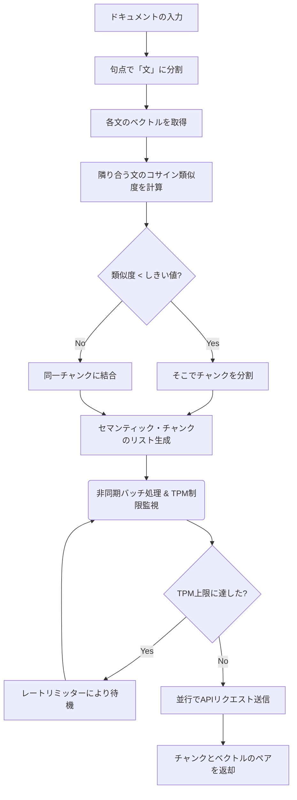

# 💻 課題23：セマンティック・チャンキングとレートリミット制御付き並行埋め込み生成（RAGインジェスト）
【対象企業】Anthropic (Applied AI), Databricks (Solutions Architect), Snowflake (Solutions Architect)

### 【ビジネス背景・お題】
RAG（検索拡張生成）のデータパイプラインにおいて、入力テキストを単純な文字数（例：500字ごと）で区切る「固定長チャンキング」は、文章の意味的な区切りを無視するため検索精度を著しく悪化させます。

そこで、隣り合う文章の「意味の類似度（コサイン類似度）」を計算し、類似度が急落する箇所（谷）で自動的に分割する**「セマンティック・チャンキング」**が現在のデファクトスタンダードです。

また、分割した大量のチャンクに対してベクトル埋め込み（Embeddings）を生成する際、APIの最大レート制限（例：1分間に最大 10,000 トークンまで）を考慮しなければ、大量リクエストによる **HTTP 429 (Too Many Requests)** エラーでデータ連携ジョブが途中でクラッシュしてしまいます。

あんたの任務は、**「①類似度計算に基づくセマンティック・チャンキング」** を行い、さらに **「②トークンレート制限（TPM）を考慮して並行処理（asyncio）で埋め込みを高速生成する」** ロバストなインジェストエンジン `SemanticRAGPipeline` を構築することよ！

---

### 📌 制約と要件

1. **コサイン類似度に基づくセマンティック・チャンキング**:
   *   入力文章を「句点（。や.）」で文（sentences）に分解します。
   *   各文の埋め込みベクトルを取得し、隣り合う文どうしの**コサイン類似度（Cosine Similarity）**を計算しなさい。
       *   コサイン類似度: $Similarity(u, v) = \frac{u \cdot v}{\|u\| \|v\|}$
   *   類似度がしきい値（例：`0.7`）未満になった境界を「文脈の切れ目」と判定し、テキストを複数のセマンティック・チャンクに分割しなさい。
2. **非同期かつ並行な埋め込み生成とレートリミット制御（Token Rate Limiter）**:
   *   生成したチャンクのリストに対し、非同期（`async`）で一斉に埋め込みベクトル（Embeddings）を生成しなさい。
   *   ただし、1分間に送信できるトークン数（TPM: Tokens Per Minute）の上限値 `max_tpm` を厳格に遵守しなさい。
   *   これを実現するため、**トークンバケットアルゴリズム**またはセマフォを用いて、並行リクエスト中に累積送信トークン数が `max_tpm` を超えないよう自動で流量調整（待機・ブロック）をかけるレート制限ロジックを実装しなさい。
3. **Mock Embedding API**:
   *   本番APIなしでローカル検証ができるよう、文の意味に応じた疑似ベクトル（次元数 3 程度の簡易ベクトル）を返し、消費トークン数も計算する `mock_embedding_api` を利用しなさい。

---

### 🔄 処理フロー

---

### 💡 この課題が「データ＆AI面接」で刺さる理由
*   **「アルゴリズムとインフラ制御の融合」**:
    単にRAGフレームワーク（LlamaIndex等）を呼び出すだけでなく、チャンキングの数学的ロジック（類似度）と、ネットワークI/Oの物理的制限（APIレート制限）を自分で実装・制御し切る「引き出しの多さ」を示せる点。
*   **「実用的バースト制御」**:
    大容量データをDWH（Snowflake等）やベクトルDBに移行する際の「信頼性と処理速度のトレードオフ」を、コードレベルでコントロールできる能力。
