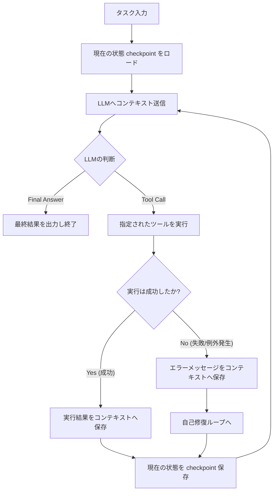

# 💻 課題24：自己修復機能・状態管理付きマルチステップAIエージェント（Function Calling & Resumable Loop）

### 【ユースケースとシステム背景】
「データベースから顧客情報を引き出し、年齢に応じて割引料金を計算し、下書きメールを作成する」といった複雑なタスクをこなす場合、LLMが外部ツール（関数）を順次呼び出しながら自律実行する **「AIエージェント（ReAct/Tool Use）」** が必須となります。

しかし、実運用におけるエージェントには以下の2つの致命的リスクが伴います。
1. **ツール呼び出しの間違い (Tool Arguments Error)**:
   LLMが関数の引数のデータ型やキーを間違えて指定し、ツール実行時に例外（エラー）が発生して処理全体がクラッシュする。
2. **長寿命実行プロセスのクラッシュ**:
   複数のツール呼び出しを何度も繰り返す長いプロセスの途中で、ネットワーク瞬断やOOM、プログラム停止が起き、それまでの実行履歴や中間結果がすべて吹き飛んでしまう。

あんたの任務は、**「①ツール実行エラー時にスタックトレースをLLMに再フィードバックして自己修復（Auto-repair）させ」**、かつ **「②各ステップ実行完了時にエージェントの内部状態（コンテキスト）を完全に保存し、クラッシュから途中再開できる」** 堅牢なマルチステップAIエージェント `ResumableAgent` をスクラッチで構築することよ！

---

### 📌 制約と要件

1. **自己修復付き Function Calling ループ (Self-Correction & Tool Execution)**:
   *   エージェントに「ユーザーの年齢をデータベースから取得するツール `fetch_user_age`」と「計算を行うツール `calculate`」を与えます。
   *   エージェントは回答を得るまで最大 `max_steps` 回（無限ループ防止）の思考・ツール実行ループを繰り返します。
   *   ツール実行時、引数の型ミスマッチ（例：数字を期待する引数に文字列を渡したなど）によりエラーが発生した場合、システムを落としてはいけません。**「発生した例外メッセージを次の会話コンテキストに動的追加してLLMに渡し、LLM自身に引数を修正させて再試行させなさい」**。
2. **状態管理とチェックポイント保存・再開 (Resumability / State Serialization)**:
   *   エージェントは各ステップ（思考、ツール呼び出し、結果）を実行するたびに、自身の「実行状態」をJSONシリアライズ（保存）しなさい。
       *   保存すべき状態: 初期タスク、現在のステップ数、これまでの会話履歴（プロンプト・回答・ツール出力のリスト）、および完了フラグ。
   *   エージェントに `checkpoint()` による現在の状態の出力と、`load_checkpoint(state_dict)` による状態の読み込みメソッドを実装しなさい。これにより、途中でエージェントが「死んだ」としても、過去の中間結果から完璧に続きを再開（Resume）できるようにしなさい。

---

### 🔄 処理フロー

---

### 💡 本実装パターンの重要性と実務上の価値
*   **「高度な例外ハンドリングとエージェント制御」**:
    ツール呼び出しの失敗を例外で終わらせず、LLMとの自己修復ループに組み込むエラーハンドリング力。
*   **「ステートフルなAI設計」**:
    メモリや会話履歴といったエージェントの状態を「シリアライズして外部ファイル（またはDB）に永続化し、いつでもステートレスなサーバーにロードして途中から再実行できる」という、実用的な本番向けエージェントシステムの設計思想。

---

### 📘 【深掘り解説】自作ReAct（プロンプトベース）と商用Tool Calling（APIネイティブ）の違い

実務や外資テックの実務では、本課題で実装した「プロンプトにツール仕様を書いて正規表現でパースするアプローチ（ReActの基本形）」と、OpenAIなどのAPIが提供する「ネイティブなTool Calling機能」の設計的な違いについて高い頻度で検証されます。

| 比較項目 | 本課題の実装（プロンプトベース・ReAct） | 商用APIネイティブ（OpenAI Tool Calling等） |
| :--- | :--- | :--- |
| **ツールの定義方法** | システムプロンプト内に自然言語で関数の説明や使用ルールを記述する。 | 関数の引数や説明を **JSON Schema** という標準規格で定義し、APIの `tools` 引数に構造化データとして渡す。 |
| **モデルの出力** | 普通のテキスト（Markdownや任意の文字列）として `CALL: func, ARGS: {...}` のようなテキストパターンを生成する。 | テキスト（`content`）は出力せず、ツール呼び出し専用の構造化された `tool_calls`（JSON形式）をモデルが出力する。 |
| **パース処理（Python側）** | 正規表現（`re.search`）や文字列分割を用いて、手動でテキストから関数名と引数を抽出する。 | OpenAI等のSDKが `tool_calls` のJSONデータを自動でPythonのオブジェクトにパースするため、手動パースが不要。 |
| **フォーマット堅牢性** | LLMの気まぐれ（JSONのパースエラーや、キーワードのスペルミス）により、正規表現マッチが崩壊しやすい。 | モデル自体が「JSON Schemaに従って正確なJSONを出力する」ように特別に訓練（ファインチューニング）されているため、壊れにくい。 |

#### 💡 本質的な共通点
アプローチは違えど、裏側で動いている物理的なライフサイクルは**100%同じ**です。
> **「LLMが関数の引数をJSON文字列として生成し、Python（プログラム側）がそれをパースして実行し、その結果をテキストとして再びLLMにフィードバックする」**

この低レイヤーのメカニズムをスクラッチで実装し理解しておくことで、LangChain等のフレームワークで「モデルが引数の型を間違える」「JSONが壊れてエラーになる」といった問題が起きた際に、プロンプトのスキーマ定義や型ガードをどう修正すべきか、ブラックボックスに頼らずピンポイントでデバッグできるようになります。

