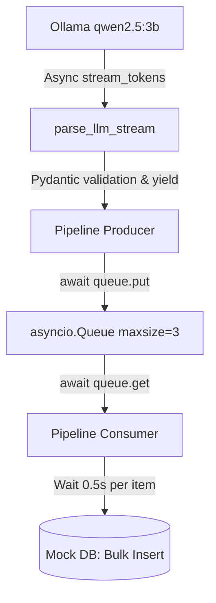

# 課題26：Ollamaを用いた非同期ストリーミング・バックプレッシャー・パイプラインの実証

本プロジェクトは、LLM（大雑把なデータ生成器）とデータベース（低速かつ安定的なストレージ）の境界で、**メモリ効率の最大化**と**流量制御（バックプレッシャー）**をどのように設計・実装するかをローカルLLMである **Ollama** を使って実証するハンズオン課題です。

---

## 🎯 目的
1. **ストリーム処理の実装**: Ollama (`qwen2.5:3b`) にJSON Lines (NDJSON) 形式でデータを生成させ、非同期ジェネレータでトークンを受信しながら改行単位で逐次パースする。
2. **バックプレッシャー（流量制御）の可視化**: 
   - データベースへの書き込み処理に意図的な遅延を挿入する。
   - `asyncio.Queue(maxsize=3)` を仲介させ、DB処理が詰まった時にProducer（LLM受信側）が自動で待機（サスペンド）し、キューが空いたら再開する様子をログ出力で可視化する。
3. **マイクロバッチング**: 一定件数が溜まるか、タイムアウト（データが途切れる）が起きるまでメモリにバッファしてからバルクインサートする。

---

## 🏗️ システム構造



- **LLM**: ローカルの `qwen2.5:3b` モデルに対して「トランザクションレコードをJSON Linesで20行生成せよ」と指示します。
- **Queue**: 上限（`maxsize=3`）を小さく設定し、バックプレッシャーが発生しやすい環境を作ります。
- **Consumer**: 1件の処理に `0.5秒` のウェイトをかけ、3件溜まるかタイムアウト（`0.3秒`）したらDBにバルクインサートします。

---

## ⚙️ 動作要件
- **Ollama**: `ollama serve` が実行されており、ローカルに `qwen2.5:3b` モデルが存在すること。
- **ライブラリ**:
  - `openai` (v1.0.0以上、非同期クライアント `AsyncOpenAI` を使用)
  - `pydantic` (v2.0以上)
  - `asyncio`

---

## 🚀 実行方法

1. Ollamaでモデルが入っていることを確認します：
   ```bash
   ollama list
   ```
   ※ もし `qwen2.5:3b` がない場合は `ollama pull qwen2.5:3b` を実行しておいてください。

2. 依存関係のインストール：
   ```bash
   pip install openai pydantic
   ```

3. プログラムの実行：
   ```bash
   python main.py
   ```

---

## 📊 観察ポイント（ログの読み方）

実行すると、以下のような時系列ログが出力されます。

1. **ストリーム開始**:
   `[LLM] Stream starting...` が出力され、LLMからトークンが少しずつ届き始めます。
2. **Producerによるキューイング**:
   1行分のJSONが完成すると、`[Producer] Queued: tx_101. Queue size: 1` と出力されます。
3. **Queue満杯による待機（バックプレッシャー発動）**:
   Consumerの処理が遅いため、Queueが満杯（size 3）になります。
   この時、Producer側のログに **`[Producer] Queue FULL! Waiting for space...`** が出力され、LLMからのトークン受信処理が一時的にサスペンドします。
4. **Consumerの消費と再開**:
   Consumerがバッチ処理を終えて `queue.task_done()` を呼び出すと、Queueに空きができます。
   その瞬間、待機していたProducerが自動的にウェイクアップし、**`[Producer] Queue space available. Resuming...`** と出力して次の行の処理を開始します。
