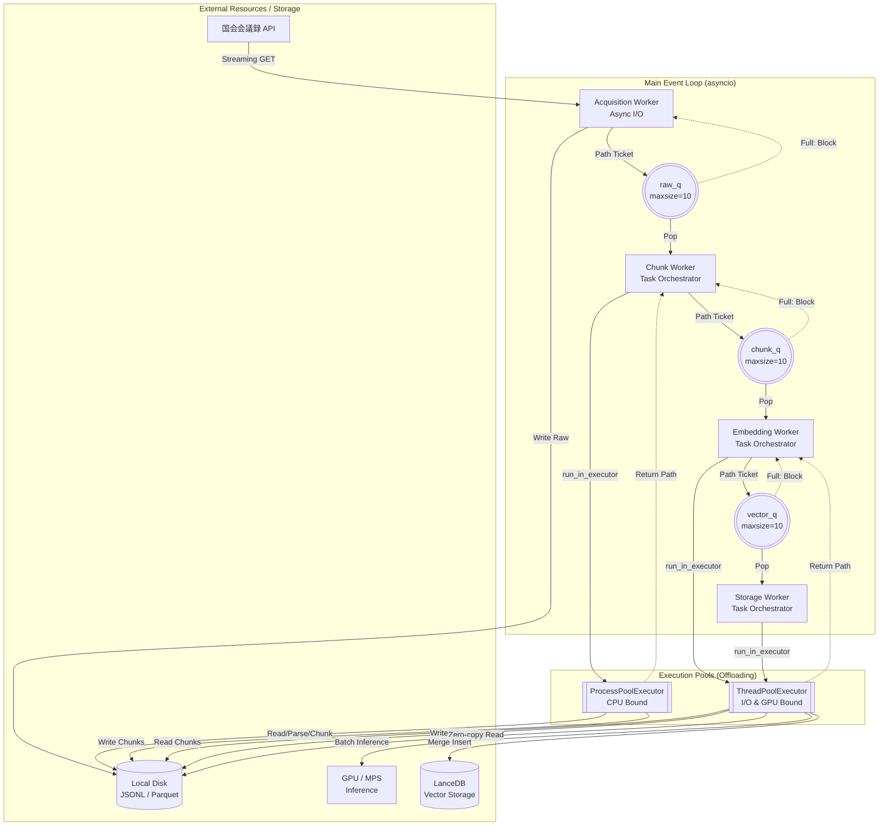
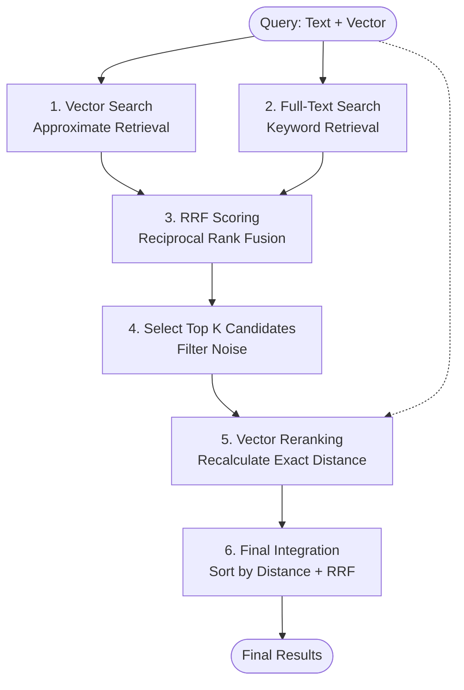

# RAG Primitive Architecture Design (STEP 1 & 2)

このドキュメントは、国会会議録 API からデータを取得し、LanceDB へ格納するまでの「理論的設計」を整理するためのものである。
「ただ動く」コードではなく、1,000万件、1億件へとスケールさせるためのシニア・データアーキテクトとしての視点を記述せよ。  
https://kokkai.ndl.go.jp/#/detail?minId=122104339X00320260312&current=1
---

## 1. 全体アーキテクチャ（System Architecture Overview）

データのライフサイクルを以下の 4 つのフェーズに分離し、**asyncio.Queue による並行ワーカー・モデル**で駆動する。

### 1.1. プロセス・スレッド分離と並行データフロー
メインのイベントループを止めないよう、重い処理を `run_in_executor` で外部プールに逃がしつつ、キューの `maxsize` で流量制限（背圧）をかけているわ。

---

## 2. データ取得（Data Acquisition）の戦略
- **ソース**: 国会会議録検索システム API。
- **取得パイプライン**: 2-Stage Pipeline（API -> Raw Data Lake）を採用。
    - **[Q] なぜ API から直接ベクトル化せず、一度ローカルに保存（Raw Data Lake）するのか？**:
    - **[A]**: **耐障害性（Resilience）**と**実験の再現性（Reproducibility）**を担保するため。
        1. **リトライ効率**: ネットワーク瞬断や API レート制限発生時、取得済みデータを保護し、未取得分のみを差分取得（Checkpointing）可能にする。
        2. **試行錯誤の高速化**: エンベッディングモデルの変更やチャンキング戦略の微調整（Hyperparameter Tuning）の際、高コストなネットワーク I/O を排除し、ローカル I/O のみで高速に再実験を回すため。
        3. **スキーマの進化（Schema Evolution）**: 後から「発言者の政党情報をフィルタリングに加えたい」等の要件が出た際、API を叩き直さずに Raw データからメタデータを再抽出するため。
- **データ構造の階層化**:
    - `Meeting` ＞ `Speech` ＞ `Chunk`
    - **[Q] 数万文字を超える「極端に長い発言（Outlier）」に対するガードレール設計は？**:
    - **[A]**: **再帰的チャンキング（Recursive Chunking）**と**メモリバッファの制限**で対応。
        1. **モデル制約**: 多くのローカルモデル（BERT系）は 512 トークン程度の入力制限がある。長文は意味の切れ目（句読点等）で分割し、複数のベクトルとして管理する。
        2. **空間計算量（OOM 対策）**: 1 発言を丸ごとメモリに載せず、ストリーミングで読み込み、一定サイズ（例: 2000文字）ごとにチャンク化してベクトル変換へ流すことで、最悪ケースのメモリ消費量を $O(1)$（定数倍）に抑える。

## 3. データパイプライン（Data Processing & Embedding）
### 「入力側で Polars を使わない」論理的根拠
データ分析の天才である Polars を、本フェーズの「エサやり」に採用しない理由は以下の 3 点にある。

1. **空間計算量 $O(1)$ の死守**: `pl.read_parquet()` は全データをメモリにロードしようとする。本システムでは Python 標準のジェネレータを用い、一度にメモリに載るデータ量を「バッチサイズ（例: 64件）」に固定し、定数倍のメモリ消費に抑える。
2. **メモリ2重持ち（Double Buffering）の回避**: Polars (Rust/Arrow) からデータを抜き出す際、Python オブジェクトへのフルコピーが発生する。これを避けるため、最初から Python の軽量な文字列としてストリーミング供給する。
3. **計算エンジンのミスマッチ**: NLP（チャンキング/トークナイズ）は CPU、推論は GPU の仕事である。

## 4. 効率化とゼロコピー（Zero-copy Efficiency）
### 「ガッチャンコ（Column Join）」のデータフロー
メタデータ（文字列）とベクトル（数値配列）を、メモリコピーを最小限に抑えて LanceDB へ格納する。

- **Zero-copy 手順**:
    1. **Vector**: `torch.Tensor` -> `.numpy()` (Shared Memory) -> `pyarrow.FixedSizeListArray` (Wrap)。
    2. **Metadata**: Python List (Batch) -> `pyarrow.array()`。
    3. **Join**: `pyarrow.RecordBatch.from_arrays` を用い、メタデータ列とベクトル列を一つのバッチに結合。

## 5. 信頼性と耐久性（Reliability & Durability）
### べき等性（Idempotency）とチェックポイント
- **Content-based Addressing**: 各チャンクの「元データID + チャンク番号 + 内容のMD5ハッシュ」を `id` として生成する。
- **Upsert 戦略**: LanceDB の書き込み時に、この `id` をキーとして既存データを確認. 再実行時の重複を排除する。

---

## 7. シニア・アーキテクトによる批判的検討（Critical Deep Dives）

### 7.3. 分散システムとしての「背圧（Backpressure）」制御
- **[Q] データの供給（API/Disk）と消費（GPU）の速度差をどう制御するか？**:
- **[A]**: **asyncio.Queue による Explicit Backpressure** を活用。
    - 各キューに `maxsize` を設定することで、後段の処理が遅延した際に前段を一時停止させ、メモリ上の未処理データが $O(N)$ で膨らむのを防ぐ。

### 7.10. メモリレイアウトと物理データフロー (CPU vs. GPU)
- **[Q] データは物理的にどこを通り、どこでコピーが発生しているか？**:
- **[A]**: **Claim Check Pattern** によるパス渡しのフロー。

### 7.11. バッチ処理と増分書き出し（Incremental Append）
- **[Q] 1億件スケールにおいて、メモリ常駐を避けつつ Parquet を作成するには？**:
- **[A]**: **pyarrow.parquet.ParquetWriter によるストリーミング書き出し** を実装。空間計算量をバッチサイズ $B$ に依存する $O(B)$ に固定した。

### 7.15. ベクトルバッチングと「独演会（Blocking）」の回避
- **[Q] Embedding や DB 書き込み中にイベントループが止まるのをどう防ぐか？**:
- **[A]**: **loop.run_in_executor による同期処理の隔離**。スレッドプールに逃がすことで、イベントループを解放し、真のストリーミングを実現した。

---
## 8. STEP 2: ハイブリッド検索とリランキングの設計（Hybrid Search Design）

1億件スケールの商用 RAG を見据え、精度と速度のトレードオフをどう管理するか。

### 8.1. 日本語全文検索におけるトークナイズ戦略
- **[Q] LanceDB (Tantivy) の FTS を使う場合、日本語の「分かち書き」をどう扱うべきか？**:
- **[A]**: **「事前分かち書き（Pre-tokenization）」** を採用し、DB に依存しない一貫性を担保する。
    1. **論理的根拠**: DB 組み込みのトークナイザーは環境依存が強く、挙動のブラックボックス化を招く。SudachiPy 等を用いて明示的にスペース区切りに変換した `content_tokenized` カラムを作成することで、検索時とインデックス時の挙動を 100% 同期させる。
    2. **ドメイン最適化**: 国会会議録特有の専門用語や固有名詞を Sudachi の辞書カスタマイズによって正しく単語分離し、ベクトル検索では拾いきれない「キーワードの完全一致」を確実に捕捉する。

### 8.2. ハイブリッド・スコアリングの数学的融合 (RRF)
- **[Q] コサイン類似度（Vector）と BM25 スコア（FTS）という、レンジの異なる値をどう統合するか？**:
- **[A]**: **RRF (Reciprocal Rank Fusion)** を採用し、生のスコアではなく「順位（Rank）」をベースに融合する。
    1. **論理的根拠**: ベクトル検索の距離（0〜2等）と BM25 のスコア（0〜数百等）は単位も分布も全く異なるため、直接の加算や正規化は困難である。RRF は「それぞれの検索結果で何位に入ったか」という相対的な順位のみを重み付けするため、手法に依存しない公平な統合が可能になる。
    2. **定数 $k$ の役割**: 共通で使用される $k=60$ は、低順位のアイテムが偶然一致した際のスコア寄与度を下げ、上位の一致をより重視するための平滑化パラメータである。この定数を調整することで、ベクトルとキーワードのどちらを優先するかの感度を微調整する。

### 8.3. 検索の 2-Stage Retrieval (Retrieve & Re-rank)
- **[Q] なぜベクトル検索だけでは不十分で、リランカー（Cohere 等）が必要なのか？**:
- **[A]**: **「高速な粗引き」と「高精度な精査」の分離**のため。
    1. **第一段階 (Retrieval)**: ベクトル検索と BM25 で上位 K 件（例: 各 50〜100件）を高速に取得し、RRF で統合する。ここでは再現率（Recall）を重視する。
    2. **第二段階 (Re-rank)**: 統合された上位 K 件に対し、ベクトル距離の再計算や Cross-Encoder 等を用いて、クエリと文書の関連性をより深く計算する。ここでは適合率（Precision）を極大化する。

### 8.4. スケーラビリティと検索性能のトレードオフ
- **[Q] 1億件の FTS インデックス構築コストと検索レイテンシをどう管理するか？**:
- **[A]**: **Incremental Indexing とリソース分離**。
    1. **インデックス管理**: LanceDB はデータの追加に合わせて FTS インデックスを増分更新できるが、大規模化に伴い構築コストが増大する。
    2. **物理的分離**: 1億件スケールでは、インデックス構築専用のノードと、検索クエリを捌くノードを分離し、検索レイテンシへの影響を最小限に抑える設計を検討する。
