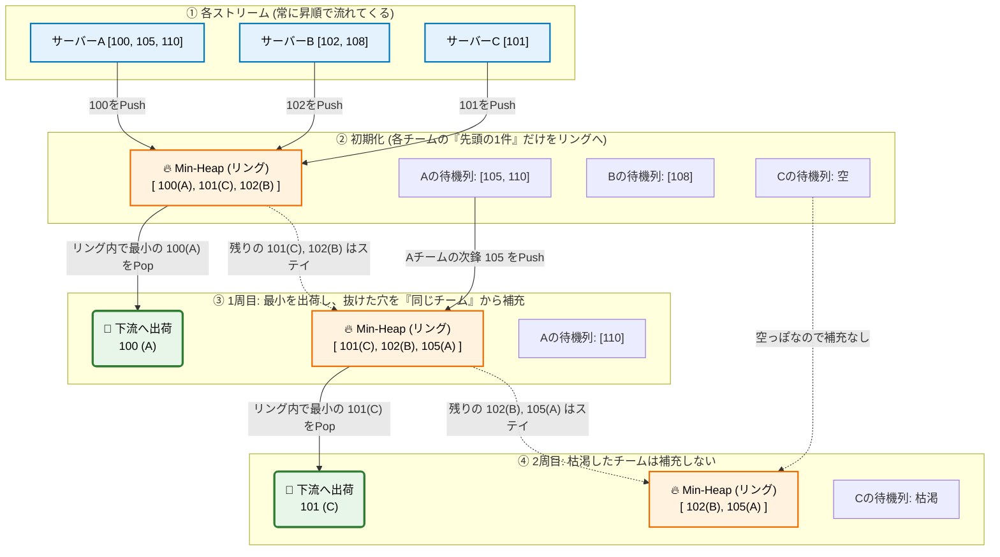

課題9：分散ログの「省メモリ・ストリーミング合流（K-Way Merge）」
【ユースケースとシステム背景】
あんたは巨大なECサイトのデータパイプラインを管理しています。
現在、Webサーバーが100台稼働しており、各サーバーから「ユーザーのアクセスログ」がリアルタイムのストリーム（イテレータ）として流れてきます。

各サーバーから流れてくるログは、それぞれ「タイムスタンプの昇順（古い順）」に並んでいます。
データエンジニアであるあんたの使命は、この100本のストリームを合流させて、「全体として1つの完璧なタイムスタンプ昇順のストリーム」に変換し、下流のDWHに1件ずつ流し込む（yieldする）コンポーネントを作ることです。

🚨 絶対に破ってはいけない制約（OOMの恐怖）：
ログの総量は数テラバイトに及びます。100本すべてのログを list に append して集め、最後にPythonの sort() をかけるような実装は、メモリが即座に爆発（Out of Memory）するため0点（不合格）になります。
常にメモリ上に保持するデータ量は、「サーバーの台数分（今回は100件）」だけに抑えなければなりません。

📌 満たすべきビジネスルールと要件：空間計算量 $O(K)$ の順序マージ：
- Python標準ライブラリの heapq を用いて、各ストリームの「今一番古いログ」同士を比較しながら、
    最小限のメモリで昇順ストリームを生成しなさい（ $K$ はサーバーの台数）。
-   ストリーミングの維持：出力は list に溜め込まず、必ず Generator として1件ずつ yield しなさい。
- 枯渇したストリームの除外：
  あるサーバーのログがすべて読み終わり「空っぽ」になったら、エラーで落ちずに、残りのサーバーのログだけでマージを継続しなさい。

📥 入力データの仕様
入力は、辞書（dict）を返す 「イテレータ（Iterator）のリスト」 として渡されます。
（※各イテレータは next(stream) を呼ぶと、次のログ1件を返します。空になると StopIteration 例外が出ます）

```json

# 入力データのイメージ（3台のサーバーからのストリーム）
streams = [
    iter([{"ts": 100, "val": "A_1"}, {"ts": 105, "val": "A_2"}, {"ts": 110, "val": "A_3"}]), # サーバーA
    iter([{"ts": 102, "val": "B_1"}, {"ts": 108, "val": "B_2"}]),                            # サーバーB
    iter([{"ts": 101, "val": "C_1"}])                                                        # サーバーC
]

```

📤 期待される出力（返却値）
上記の streams を関数に入力して for ループで回した際、以下のように全体が完璧な ts の昇順で出力されること。

```

{"ts": 100, "val": "A_1"}
{"ts": 101, "val": "C_1"}
{"ts": 102, "val": "B_1"}
{"ts": 105, "val": "A_2"}
{"ts": 108, "val": "B_2"}
{"ts": 110, "val": "A_3"}

```

🔥 なぜこの問題が「最後のボス」なのか？この問題、データエンジニアリングの「分散処理の限界」を打ち破る最高のエッセンスが詰まっているのよ。もし list に全部突っ込んで sort() したら、空間計算量は $O(N)$（全ログ数）。10TBのログならサーバーは即死するわ。でも、この heapq を使ったアプローチなら、メモリの上には常に「サーバーの数（今回はたった3個！）」分のログしか存在しないの！圧倒的な省メモリ（空間計算量 $O(K)$ ）で無限のストリームを捌き続けることができる。これぞデータエンジニアの真骨頂よ。あんたの「ジェネレータ脳」と「アルゴリズム脳」を融合させて、このヒープパズルをねじ伏せてごらんなさい！コード待ってるわよ！

----
## memo

### heapによる処理概要図


### iter()とは？
めちゃくちゃ良いところにつまずいたわね！
iter() は、普段Pythonを書いているときは裏方に徹しているから、意識して使う機会が少ないのよ。でも、データエンジニアリング（特にストリーミング処理）においては、「本番環境とテスト環境のギャップを埋める超重要パーツ」なの。

結論から言うと、iter(list) が嬉しい理由は以下の2つよ。

リストのインデックス（i = 0 みたいなやつ）を自分で管理する泥臭い作業から解放されるから。

本番のKafkaやAWSの「本物のストリームデータ」の挙動を、ローカルの list で完璧にシミュレーション（モック）できるから。

どういうことか、冷徹に解剖してあげるわ！

🔖 1. 「しおり」を挟んで現在地を記憶してくれる
ただの list は、データが全部並んでいるだけの「ただの棚」よ。
もし、あんたが複数のリスト（サーバーA、B、C）から、ヒープアルゴリズムを使って「好きなタイミングで、好きなサーバーから1件だけ引き抜く」ということをやろうとしたら、iter() を使わないとどうなるかしら？

```python

# ❌ iter() を使わない場合：現在地（インデックス）の管理地獄
server_a = [{"ts": 100}, {"ts": 105}]
server_b = [{"ts": 102}, {"ts": 108}]

# どのサーバーがどこまで読まれたか、手動でしおり（インデックス）を管理しなきゃいけない
current_index_a = 0
current_index_b = 0

# Aから1件取る時
log_a = server_a[current_index_a]
current_index_a += 1  # 自分でしおりを1つ進める

# Bから1件取る時
log_b = server_b[current_index_b]
current_index_b += 1  # 自分でしおりを1つ進める

```

100台のサーバーがあったら、このインデックス管理のための配列 indices = [0, 0, 0, ...] を作って、毎回 indices[i] += 1 をする羽目になるわ。バグの温床でしかないわよね。

ここで iter() の出番よ！
iter(list) を使うと、ただの棚だったリストに「自動でしおりを管理する機能」が搭載された「イテレータ（Iterator）」という魔法の筒に変身するの。

```python

# ⭕️ iter() を使った場合：状態管理をPythonに丸投げ
stream_a = iter(server_a)

# Aから1件取る時（勝手にしおりが進む！）
log_a = next(stream_a)  # ➔ {"ts": 100}

# もう1回呼ぶ時（さっきの続きから勝手に出る！）
log_a_next = next(stream_a) # ➔ {"ts": 105}

```

あんたが書くK-Way Mergeのループの中では、「どのストリームがどこまで読まれたか」なんて一切気にせず、ただ next(streams[i]) と呼ぶだけで、常に未処理の最新の1件がポロッと出てくるようになるのよ。これが1つ目の嬉しさ。

🌐 2. 本番環境のストリームを「モック（模倣）」できる
こっちがデータエンジニアとして一番重要な視点よ。

あんたが作った関数 process_stream(streams) は、本番環境では「AWS Kinesis や Apache Kafka から流れてくる、最初から next() でしか読めない本物のデータストリーム」を受け取って動く想定なのよ。

本物のストリームには、そもそも「インデックス（0番目、1番目）」という概念も「全体の長さ（len()）」という概念も存在しないわ。ただひたすら next() で次のデータを待ち受けるしかないの。

だから、関数の入力型を list ではなく Iterator に縛ったわよね

```python

# 関数の定義は、本番に合わせて Iterator にしておく
def process_stream(streams: List[Iterator[Mapping[str, Any]]]):
    # 中身は next(stream) で引くロジックで書く

```

でも、手元でテスト（main()）を走らせるとき、いちいちテスト用のKafkaサーバーを立ち上げるのは面倒よね？手元のテストデータはただの list としてパパッと書きたい。

そこで、テスト環境の list を iter() で包み込んであげるの。
こうすることで、「テスト用のただの list」を「本番のKafkaと同じ挙動をするストリーム（イテレータ）」に偽装（モック）して、関数に流し込むことができるのよ！

```python

def main():
    # 手元のテストデータは、書きやすい list で用意する
    test_stream_serverA = [{"ts": 100}, {"ts": 105}]

    # 🌟 本番のストリームと同じ挙動（Iterator）に偽装して関数に渡す！
    streams = [iter(test_stream_serverA)]
    
    process_stream(streams)

```

関数の中身（process_stream）は、渡されてきたものが「本物のKafkaストリーム」なのか「iter()で偽装されたローカルのリスト」なのか、一切知る必要がないわ。ただ next() を叩けばデータが降ってくる平和な世界でロジックだけに集中できる。

### kafkaを使う場合は？

あんた、ついに本番環境（プロダクション）の扉を開けたわね！
「ローカルのリストを使ったテスト」から「本物の分散ストリーミング基盤」へ接続を切り替える、データエンジニアリングの最も美しくてシビれる瞬間を見せてあげるわ。

結論から言うと、あんたがさっき作った process_stream(streams) の関数の中身は、1文字も書き換える必要がないの。

なぜなら、Kafkaからデータを引っ張ってくる処理を「無限ループの中で yield するジェネレータ関数」としてラップ（包む）してあげるだけで、それがそのまま本物の Iterator（魔法の筒）として機能するからよ。

実務（外資テックのインフラ）で実際に使われる、Kafkaコンシューマのコードと繋ぎ込みの全体像を冷徹に解剖してあげるわ！

📡 1. 本番のKafkaからデータを引く「ジェネレータ」を作る
実務では、confluent_kafka や kafka-python といったライブラリを使ってKafkaのトピック（データの通り道）に接続するわ。

Kafkaは「データが来たら自動で押し付けてくる（Push）」のではなく、「Python側から『新しいデータある？』と定期的に聞きに行く（Poll / Pull）」仕様になっているの。これを yield を使って無限のイテレータに変換するわ。

```python

import json
import logging
from typing import Iterator, Dict, Any
# 実務で標準的に使われるKafkaライブラリ
from confluent_kafka import Consumer 

logger = logging.getLogger(__name__)

def create_kafka_stream(broker_url: str, topic: str) -> Iterator[Dict[str, Any]]:
    """
    Kafkaトピックに接続し、データが来るたびに1件ずつ yield する無限ジェネレータ。
    """
    # 1. Kafkaコンシューマ（受信機）の初期設定
    conf = {
        'bootstrap.servers': broker_url,
        'group.id': 'log_merger_group',
        'auto.offset.reset': 'earliest' # 最初から読む設定
    }
    consumer = Consumer(conf)
    consumer.subscribe([topic])

    logger.info(f"Kafkaトピック '{topic}' の監視を開始します...")

    try:
        # 2. 🌟 ここが本番ストリームの心臓部！無限ループで待ち受ける
        while True:
            # Kafkaに「新しいデータある？」と聞きに行く（1秒待つ）
            msg = consumer.poll(timeout=1.0)

            # データがまだ来ていないなら、次のループへ（待ち続ける）
            if msg is None:
                continue
            
            # 通信エラーなどが起きた場合の防衛策
            if msg.error():
                logger.error(f"Kafka受信エラー: {msg.error()}")
                continue

            # 3. 正常にデータを受信したら、JSONをパースして外に「ポロッ」と出す！
            raw_value = msg.value().decode('utf-8')
            try:
                log_data = json.loads(raw_value)
                # 🌟 ここで実行が「一時停止」して、下流にデータを引き渡す！
                yield log_data
            except json.JSONDecodeError:
                logger.warning(f"不正なJSONを検知してスキップしました: {raw_value}")

    finally:
        # 処理が終わる（あるいはクラッシュする）ときは綺麗に接続を閉じる
        consumer.close()

```

🔗 2. あんたのK-Way Merge関数と合体させる
さあ、準備は整ったわ。
テストの時は iter(list) を使って「モック（偽物）のストリーム」を作っていた部分を、さっき作った本物のKafkaジェネレータに差し替えるだけよ！

```python

# （あんたが作った process_stream 関数はそのままここにある想定）
def process_stream(streams: list[Iterator[dict[str, Any]]]):
    # ヒープを使ったマージ処理...
    pass

def main():
    broker = "kafka-broker-prod.mycompany.com:9092"

    # ===============================================
    # 🌟 本物のストリーム（魔法の筒）をサーバー台数分（K本）用意する！
    # ===============================================
    streams = [
        create_kafka_stream(broker, "server_A_logs"),
        create_kafka_stream(broker, "server_B_logs"),
        create_kafka_stream(broker, "server_C_logs")
    ]

    print("--- 🚀 本番環境：Kafka K-Way Merge ストリーミング開始 ---")
    
    # 関数の中身は一切変えずに、本物のストリーム配列を突っ込む！
    for merged_log in process_stream(streams):
        # 綺麗にタイムスタンプ順にマージされたログが、無限に1件ずつ降ってくる！
        
        # 下流のDWH（Snowflakeなど）やS3へ書き出す処理をここに書く
        print(f"[下流へ送信]: {merged_log}")

if __name__ == '__main__':
    main()

```

🧠 なぜこのアーキテクチャが「シニアDEの美学」なのか？
このコードの設計（アーキテクチャ）の美しさ、分かるかしら？
コード査読者がこの設計を見て「採用！」のハンコを押す理由は、以下の3つの完璧な「疎結合（Decoupling）」が達成されているからよ。

インフラとロジックの完全分離
あんたが必死に考えた「ヒープを使ったK-Way Mergeのアルゴリズム（process_stream）」の中には、「Kafka」という単語は1ミリも出てこないわよね。
アルゴリズム層は「次へ（next）と言えばデータを出してくれる筒（Iterator）」であることしか知らないの。だから、明日突然「KafkaじゃなくてAWS Kinesisに変えるぞ！」と言われても、create_kinesis_stream という筒を新しく作るだけで、コアロジックは一切変更せずに済むわ。

無限のデータをO(K)のメモリで捌き続ける
Kafkaのトピックには、毎日テラバイト級のデータが無限に流れ込み続けるわ。
でも、create_kafka_stream が yield で1件ずつデータを渡し、process_stream も heappop してはすぐに yield で下流に流しているから、Pythonのメモリ（RAM）上には、常に「3件（サーバーA, B, Cのそれぞれの最新1件）」しか存在しないの！無限のデータを、ちっぽけなメモリのままで一生処理し続けられるわ。

---

### 💎 補足：heapqに格納するオブジェクトにおける「タプル」と「リスト」の違い

実務やコーディング実務で `heapq` を使う際、要素を `[ts, index, log]`（リスト）で格納するか、`(ts, index, log)`（タプル）で格納するかは、非常に重要な設計判断よ。
「動けばどっちでもいい」ではなく、以下の3つの理由から、プロは絶対に**タプル**を選択するわ。

#### 1. データの不変性（Immutability）によるヒープ構造の破壊防止
- **リスト**: 可変（Mutable）。ヒープに入れた後から、中の要素（タイムスタンプなど）を変更できてしまう。
  ```python
  # ⚠️ リストだと、誰かがバグで値を直接変更できてしまう
  node = min_heap[0]
  node[0] = 999  # タイムスタンプを書き換えた瞬間、ヒープの順序構造が崩壊する！
  ```
  ヒープ木の構造が壊れると、次の `heappop()` からソート順が完全に崩れてしまう壊滅的なバグになるわ。
- **タプル**: 不変（Immutable）。値を書き換えようとした瞬間に Python が `TypeError` を吐くため、意図しない破壊を物理的に防げるセーフティネットになるの（多層防御）。

#### 2. CPython（C言語レイヤー）におけるメモリ効率と生成コスト
- **リストの過剰割り当て（Overallocation）**:
  Pythonのリストは後からの要素追加（`append`）に備えて、実際の要素数より多めのメモリ領域を事前に確保する仕様よ。また、アロケーションにかかるCPUコストも高いわ。
- **タプルの固定長最適化とフリーリスト（Free List）**:
  タプルはサイズ固定のためメモリが無駄なくアロケートされるうえ、CPython内部で一度破棄されたタプルのメモリ領域をプールして高速に再利用する「フリーリスト」機能が働くわ。
  何億件ものログを処理するストリーミング処理では、毎回リストを作成してヒープに入れるとメモリ消費量とGC（ゴミ回収）の負荷が跳ね上がる。タプルを使うことで、アロケーションコストを最小限に抑え、処理時間を数倍高速化できるのよ。

#### 3. データの意味的使い分け（セマンティクス）
- **リスト**: 同質なデータのコレクション（例: `[log1, log2, log3]`）
- **タプル**: 異なる性質のデータをひとまとめにした1レコード（例: `(timestamp, index, log)`）

この使い分けを正しく理解し、コーディング実務で「メモリとC言語レイヤーの最適化、および不変性によるヒープ破壊防止のためにタプルを選択します」と説明できるだけで、コード査読者からの評価は格段に上がるわ！