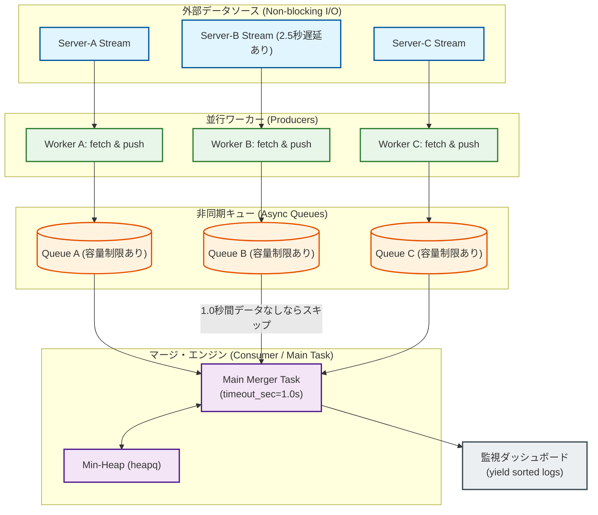
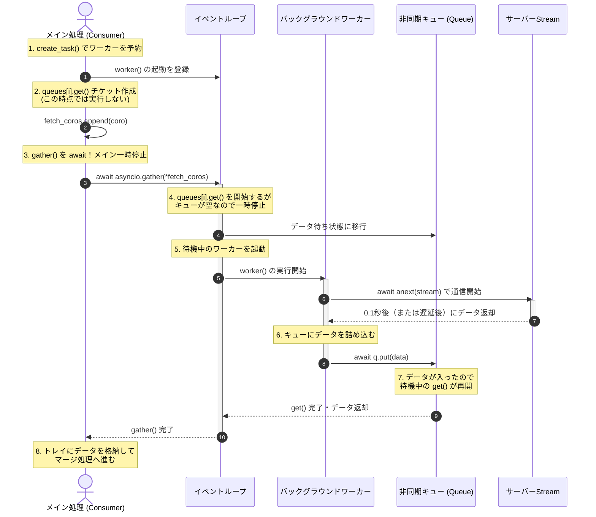
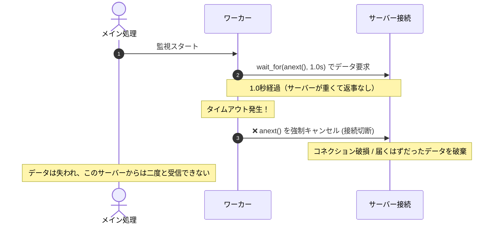
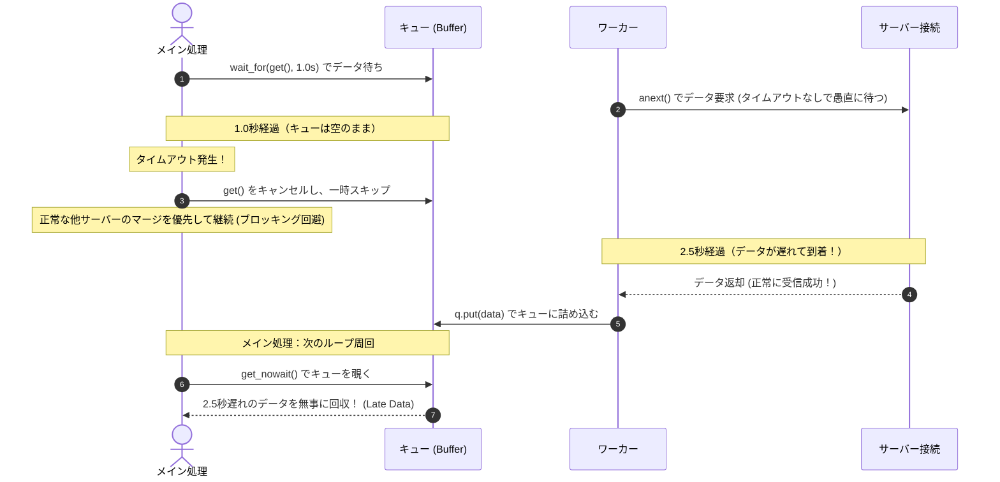
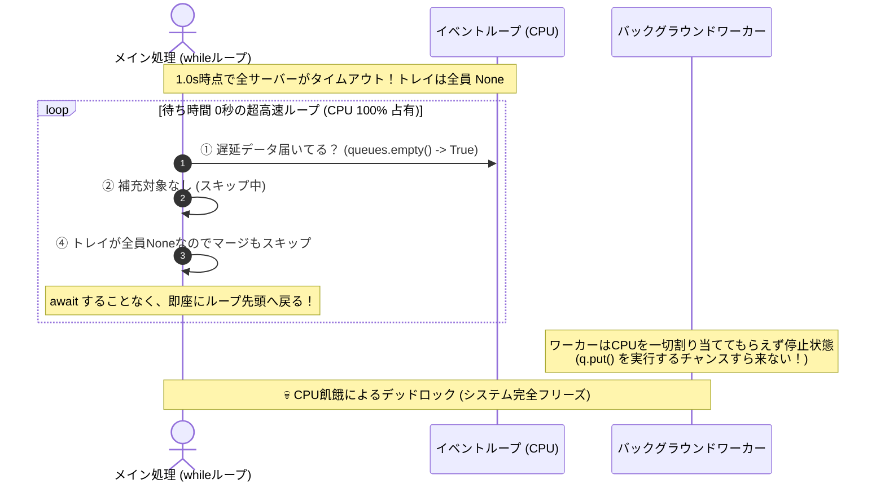
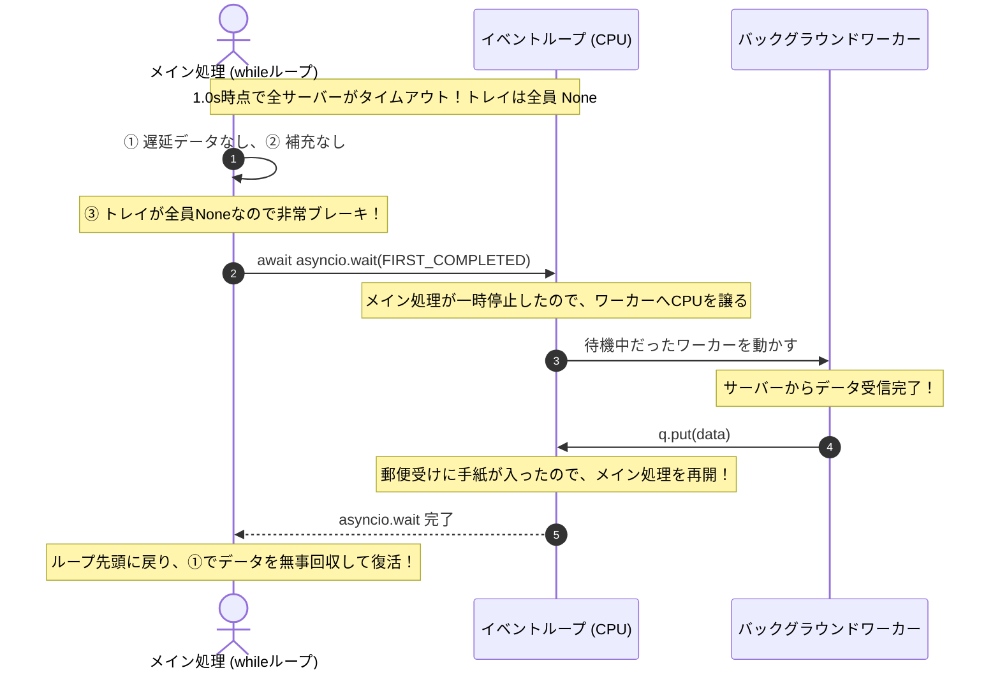

# 課題13：非同期I/Oとタイムアウト制御を備えた分散ストリーム・マージ（Asyncio K-Way Merge with Timeouts）

### 【ユースケースとシステム背景】
あなたは金融取引システムのリアルタイム監視基盤を開発しています。
各取引サーバー（計 $K$ 台）から、ミリ秒単位のタイムスタンプ順（昇順）にソートされた「取引ログ」がネットワーク（非同期ストリーム）経由で流れてきます。

あなたの任務は、これらの非同期ストリームを合流させ、全体として完璧なタイムスタンプ昇順のストリームを生成し、リアルタイム監視ダッシュボードに `yield` する（非同期ジェネレータ）コンポーネントを構築することです。

### 🚨 設計において考慮すべき極限状態の要件：

1. **非同期I/Oと並行処理（`asyncio`）の活用:**
   各ストリームからのデータ取得はネットワークI/O待ちが発生します。ブロッキングなI/Oや、単純なループでの `await` は、1つの遅いサーバーに引きずられて全体の遅延（レイテンシ）を悪化させるため不合格になります。`asyncio` を用いて、すべてのストリームから**非同期かつ並行**にデータをバッファリングしなさい。

2. **タイムスタンプ順の維持（Min-Heap）:**
   基本ロジックは `heapq` を用いた K-Way Merge です。

3. **リアルタイム障害耐性（タイムアウト制御とブロッキング回避）：**
   ネットワーク遅延やサーバーの過負荷により、特定のサーバー（例: サーバーB）からのレスポンスが一時的に途絶える（ストールする）ことがあります。
   - ストリームからデータを待つ際、閾値（例: **1.0秒**）を超えてデータが届かない場合、**そのストリームを待つのを諦めて一時的にスキップし、他の正常なストリームのマージを継続**しなさい。
   - これにより、1台 of サーバーの遅延がシステム全体のパイプラインを停止させる（ブロッキング）のを防ぎます。
   - 遅延したサーバーから後からデータが届いた場合（Late Data / 遅延データ）、ダッシュボード側には警告ログを出力した上で、マージ（または遅延データとして特別処理）しなさい。

---

### 💡 非同期設計のディープダイブ：なぜ単純な非同期処理ではダメなのか？

実務で高頻度・低レイテンシなリアルタイムシステムを構築する際、非同期処理のアンチパターンを理解することが極めて重要です。

#### ❌ 1. 単純な `for` ループ内での `await`（直列実行の罠）
```python
for stream in streams:
    data = await anext(stream)
```
- **なぜダメか**:
  `await` は「処理を一時停止してイベントループに制御を返す」だけであり、呼び出し元のコルーチンはその箇所で一時停止します。つまり、`stream_A` の応答が返ってくるまで、`stream_B` に対するリクエストすら送信されません。1台の遅いサーバーが存在するだけで、システム全体が直列のボトルネックに引きずられてしまいます。

#### ❌ 2. 単純な並列リクエスト（`asyncio.gather` などのロックステップ限界）
```python
tasks = [asyncio.create_task(anext(s)) for s in streams]
results = await asyncio.gather(*tasks)
```
- **なぜダメか**:
  - **遅いサーバーに引きずられる (ロックステップ同期)**: `asyncio.gather` はすべてのタスクが完了するまで全体をブロックします。サーバーAの応答に2.5秒、サーバーBに0.1秒かかる場合、Bのデータが0.1秒時点で完了していても、Aが完了する2.5秒後まで全体の処理（マージ）を進められません。
  - **ストリーム間の速度差に対応できない**: 実務では各サーバーから送られるログの流量（スループット）に偏りがあります。一括の `gather` では、全サーバーから1件ずつ均等にしか進められないため、高速なストリームのデータを滞留させてしまいます。

#### ⭕ 解決策：非同期の「Producer-Consumer & Buffer」パターン
これらの課題をすべて解決するため、以下の構成をとります（詳細は下図参照）。

1. **並行ワーカー (Producers)**: 各ストリームから独立してデータを吸い上げ、各ストリーム専用の `asyncio.Queue`（バッファ）に即座に詰め込むバックグラウンドタスクを `asyncio.create_task` で一斉起動します。
2. **マージ・エンジン (Consumer)**: 各キューの上澄み（先頭データ）を監視し、`heapq` を用いて最古のタイムスタンプを持つデータから順番に `yield` します。
3. **タイムアウト制御**: 特定のキューが空のとき、`asyncio.wait_for(queue.get(), timeout=1.0)` で待ち時間を制限し、タイムアウトした場合はそのキューをスキップして処理を続行します。これで、システム全体のブロッキングを完全に防ぎます。

---

### 📐 アーキテクチャ構成図 (Producer-Consumer & Buffer Pattern)



### 🔄 実行ライフサイクル：イベントループとワーカーの連携シーケンス

チケット（コルーチンオブジェクト）が生成され、`await asyncio.gather` によってワーカーの `q.put` とメイン処理の `q.get` がバトンタッチされる一連の動きよ。



---

### 📥 入力データの仕様

入力は、非同期ジェネレータ（`AsyncIterator`）のリストとして渡されます。
各ジェネレータは `await anext(stream)` を呼ぶと、次のログ1件を返します。データが終了すると `StopAsyncIteration` が発生します。
また、意図的に遅延をシミュレーションするための `asyncio.sleep()` が逆システム的に発生します。

```python
# ログフォーマット
# {"ts": タイムスタンプ(int), "server": サーバー名(str), "val": メッセージ(str)}
```

---

### 📤 期待される出力のイメージ

例えば、サーバーA, B, Cのうち、サーバーBが途中で遅延した場合：

```text
2026-06-23 15:00:00 - INFO - [Server-A] Log fetched: {"ts": 100, ...}
2026-06-23 15:00:00 - INFO - [Server-C] Log fetched: {"ts": 101, ...}
2026-06-23 15:00:01 - WARNING - [Timeout] Server-B is non-responsive for 1.0s. Skipping temporarily to avoid blocking.
2026-06-23 15:00:01 - OUTPUT - {"ts": 100, "server": "Server-A", "val": "tx_start"}
2026-06-23 15:00:01 - OUTPUT - {"ts": 101, "server": "Server-C", "val": "tx_ok"}
# サーバーBが遅れてデータを送ってきた場合
2026-06-23 15:00:03 - WARNING - [Late Data] Received delayed data from Server-B: {"ts": 102, ...}
```

---

### 💡 この課題で学べること（シニアFDEの必須スキル）

- **非同期Producer-Consumerパターン:** 各ストリームから並行してデータをフェッチする「ワーカー（Producer）」と、それらをマージして消費する「マッパー（Consumer）」を `asyncio.Queue` を介して疎結合にする設計。
- **タイムアウトハンドリング:** `asyncio.wait_for` や `asyncio.wait` を用いた、非同期タスクのタイムアウト制御。
- **バックプレッシャー（背圧）の管理:** 処理速度の差によるメモリ破綻を防ぐためのキューサイズ制限。
- **実務でのトレードオフの決断:** 「全ストリームの順序を完全に保証するために待つか」「リアルタイム性を最優先して遅延サーバーを切り捨てるか」という分散システム最大のジレンマに対する実装力。

---

### 💡 設計対比とアーキテクチャ考察

#### 1. 同期K-Way Merge（課題9）との決定的な違い
- **課題9 (同期 / ローカル)**:
  データソースはローカルメモリやローカルディスク（SSD）上のソート済みファイルであるため、`next()` によるデータ取得レイテンシはナノ秒〜マイクロ秒単位（ほぼゼロ）です。
  I/O待ちが発生しないため、マルチスレッド化やキューによる非同期化は余計なオーバーヘッドを生むだけであり、**シングルスレッドのプル型ジェネレータ（`yield` + `heapq`）**による空間計算量 $O(K)$・時間計算量 $O(N \log K)$ の処理が最も高いスループットを発揮します。
- **課題13 (非同期 / ネットワーク)**:
  データソースは異なるネットワークサーバー（分散システム）であり、データ取得にミリ秒〜秒単位のネットワークI/O待ちや一時停止が発生します。
  1つの遅いサーバーが全体の処理をブロッキングするのを防ぐため、**「非同期ワーカーによる並行バッファリング (Producer-Consumer)」**と**「タイムアウト制御」**による疎結合設計が必須となります。

#### 2. なぜ `ServerStream` をクラス（特殊メソッド）で自作したのか？
1. **非同期イテレータのサポート**:
   通常の `iter()` が返すのは同期イテレータです。通信遅延をシミュレートするための `await asyncio.sleep()` をループの中に挟むには、非同期イテレータプロトコル（`__aiter__` と `__anext__`）を実装した `AsyncIterator` クラスを自作する必要があります。
2. **メタデータの保持**:
   どのサーバーから流れてきたログかをロギング・デバッグしやすくするため、ストリームオブジェクト自体に `name` 等のメタデータを保持させたいという実務的な理由があります。
3. **別解（非同期ジェネレータ関数）とのトレードオフ**:
   `yield` を用いた非同期ジェネレータ関数（`async def stream_func()`）でも同様のイテレータは作成できますが、あえて `__aiter__` と `__anext__` 特殊メソッドを持つクラスとして実装することで、Pythonの低レイヤーにおけるイテレータプロトコルおよび `StopAsyncIteration` 例外のライフサイクルの理解度をコード査読者にアピールすることができます。

#### 3. なぜタイムアウトをワーカー側ではなくキュー側でかけるのか？
データ消失を防ぎ、I/Oを安全に継続するための極めて重要な設計思想です。下のスライド（カルーゼル）で処理の流れと違いを視覚的に比較できます。

### ❌ アンチパターン：ワーカー側でタイムアウトをかける場合

<!-- slide -->
### ⭕ 推奨パターン：メイン（キュー側）でタイムアウトをかける場合


#### 4. 自力で実装するための「4つの思考ステップ（多層防御の設計ストーリー）」
この複雑な非同期マージロジックは、一撃で思いつくものではありません。以下のストーリーに沿って、ハッピーパスから順に例外に対する防衛策を肉付けしていくことで、この堅牢なロジックに自力でたどり着くことができます。

1. **ステップ1：ハッピーパス（理想状態）の設計**
   - 「遅延のないクリーンな世界」を想定し、K本のストリームの先頭データを比較・マージする基本サイクルを作ります。
   - これが **「④ ビジネスロジック（マージ）」** と **「② 空トレイの補充（タイムアウトなし版）」** です。（※この時点では同期の [課題9](file:///Users/miwanoshuuhei/01_gitProject/09_portfolio/課題9/README.md) と同等）。
2. **ステップ2：タイムアウトの導入（現実の制約）**
   - 「1台のネットワーク遅延で全体をブロッキングしたくない」という制約を入れ、補充処理に時限爆弾（`asyncio.wait_for`）を導入します。
   - タイムアウトが発生した場合は、そのサーバーを「スキップ状態（`timed_out=True`）」にして、残りのデータだけでマージへ進ませます。
3. **ステップ3：遅延データの自動回収（スキップからの復帰）**
   - 「スキップされたサーバーBが、後から遅れてデータを届けてくれたらどうするか？」を考えます。
   - ループが新しく始まるたびに、まず最初に「スキップ中のサーバーのキューにデータが届いていないか」を待ち時間なし（`get_nowait()`）で覗きに行きます。
   - これが、ループの最頭部にある **「① 遅延データの自動回収」** の正体です。
4. **ステップ4：非常ブレーキ（CPU暴走の防止）**
   - 「すべての動いているサーバーが同時にタイムアウトし、手元のバッファが全員 `None` になったらどうなるか？」という極限のエッジケースを考えます。
   - トレイが全部空だとステップ④は素通りされ、次の周も補充が走らず、待ち時間0秒の無限ループ（Busy Loop）でCPU使用率が100%に張り付きフリーズします（シングルスレッドなので、裏のワーカーにCPUの順番が全く回らなくなる）。
   - これを防ぐため、「手元が全員空なら、どれか1台が復帰するまで時間無制限でじっと待つ」という **「③ 緊急待機（非常ブレーキ）」** を仕込みます。
   - この「CPU暴走（飢餓状態）」と「非常ブレーキによる譲り合い」の違いを、以下のスライド式シーケンス図で視覚的に比較しなさい。

### ❌ 非常ブレーキ（ステップ③）がない場合のCPU暴走 (Starvation)

<!-- slide -->
### ⭕ 非常ブレーキ（ステップ③）がある場合の譲り合い (Cooperative)


このように、「理想 ➔ 正常な補充 ➔ 遅れの回収 ➔ 暴走の防止」と段階的に防衛ラインを積み上げることで、この高度な非同期マージ処理が完成します。

---

## 🛠️ チャレンジ

この仕様を満たす Python テンプレートを `main.py` として用意したわ。
非同期処理特有のデッドロックや、キューのバッファリング、タイムアウト時のエラーハンドリングを考慮して、堅牢なコードを書き上げてみなさい！
