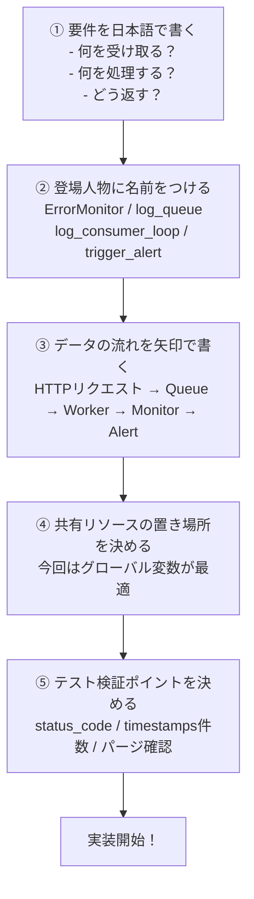
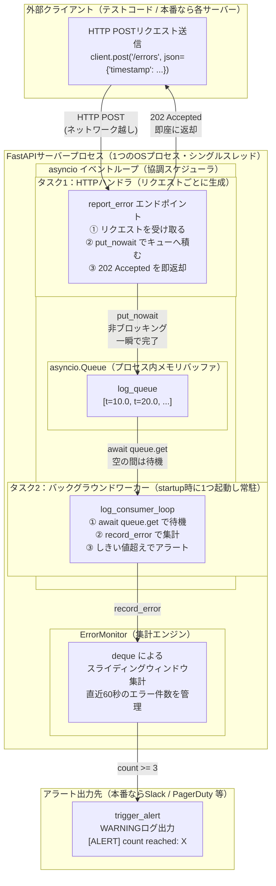
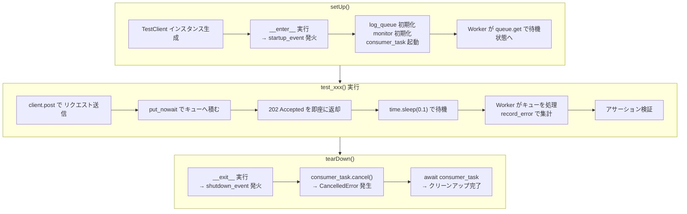

# 💻 課題25：FastAPI + Asyncio Queue による非同期ログ集計API


---

## 📖 【ユースケースとシステム背景】
高トラフィックな環境において、システムの健全性を監視するリアルタイムログコレクターAPIを設計します。
クライアント（各サーバーやエージェント）から毎秒数千件ペースで「エラーが発生した」という通知がHTTP POSTリクエストで届きます。

APIの応答速度を極限まで高め、かつ大量のアクセス急増（スパイク）でAPIサーバーがクラッシュするのを防ぐため、リクエストハンドラ内では重い集計処理やアラート通知処理を直接実行せず、**「非同期キュー（`asyncio.Queue`）」**にタスクを投げ込んで即座にレスポンスを返す設計（非ブロッキング）にします。

裏側では、常駐する**バックグラウンドワーカー（コンシューマタスク）**がキューを監視し、届いたエラーログを取り出して `ErrorMonitor` で直近60秒間のエラー数をカウントし、しきい値を超えたらアラートを送信します。

---

## 📌 【機能要件と仕様】

FastAPIを用いて、以下の仕様を満たすAPIサーバーおよびテストコードを実装しなさい。

### 1. APIエンドポイント
*   **パス**: `POST /errors`
*   **リクエストボディ**: JSON形式 `{"timestamp": float}`
*   **レスポンス**: JSON形式 `{"status": "accepted", "timestamp": float}`（ステータスコード: `202 Accepted`）
*   **挙動**: 
    1.  リクエストを受信したら、タイムスタンプを非同期キュー（`asyncio.Queue`）に追加する。
    2.  キューへの追加は一瞬で終わらせ、バックグラウンドでの集計処理を待たずに、クライアントへ即座にレスポンスを返す。

### 2. バックグラウンドワーカー（コンシューマタスク）
*   アプリケーションの起動時（`startup` イベント）に、`asyncio.create_task` を用いて、キューを無限ループで監視するワーカータスクをバックグラウンドで常時起動させる。
*   ワーカーは、キューからタイムスタンプを取り出し、課題10で作成した `ErrorMonitor` クラスを用いて、直近60秒間のエラー件数を集計する。
*   窓内のエラー件数が **3件以上** に達した場合、模擬アラート関数 `trigger_alert(count: int)` を呼び出し、ログに `[ALERT] Direct Action Required! Error count reached: X` と出力する。

### 3. アプリケーション終了時の処理
*   アプリケーションの終了時（`shutdown` イベント）には、バックグラウンドタスクを安全にキャンセル（`cancel()`）し、正常終了（クリーンアップ）させること。

---

## ⚙️ 【非機能要件と評価基準】
*   **非ブロッキング設計**: HTTPリクエストハンドラ内で `await asyncio.sleep()` や重いI/Oを同期的に実行しないこと。
*   **関心の分離**: Webサーバー（FastAPI）、キュー制御（Asyncio Queue）、集計ロジック（ErrorMonitor）が適切に分離され、それぞれの役割のみを持っていること。
*   **統合テストの網羅性**: 
    *   FastAPIが提供する `TestClient`（または `httpx.AsyncClient`）を使用して、実際にAPIを呼び出し、バックグラウンドでキューを経由して集計が行われているかを検証するテストコードを実装すること。
    *   非同期処理の完了を待つために、適切な待機処理（`await asyncio.sleep()`等）をテスト側に挟む工夫をすること。

---

## 🧠 【設計思考のステップ】

このコード構成に辿り着くための「設計の道順」を示す。コードを丸暗記するのではなく、**この5段階の思考プロセスを自分のものにすること**がシニアDEへの近道。

### Step 1：「何が欲しいか」を日本語で書き出す

コードを1行も書く前に、システムが何をするのかを日本語の箇条書きで整理する。

```text
- エラーログのタイムスタンプを受け取る「窓口」が必要
- 受け取ったデータを「どこかに溜めておく場所」が必要
- 溜まったデータを「裏でコツコツ処理する係」が必要
- 処理した結果が3件を超えたら「アラートを出す機能」が必要
- 窓口はデータを受け取ったら「即座に返事を返す」（処理の完了を待ってはダメ）
```

この時点で「**プロデューサー（窓口）とコンシューマー（処理係）を分離しないと要件が満たせない**」と分かる。

---

### Step 2：「登場人物（コンポーネント）」に名前をつける

日本語の要件を、Pythonで何というクラス・変数・関数で表現するかにマッピングする。

| 日本語の要件 | Pythonコンポーネント |
|:---|:---|
| 集計ロジック | `ErrorMonitor` クラス（課題10の再利用）|
| 溜めておく場所 | `asyncio.Queue`（`log_queue`）|
| 処理係（常駐ワーカー） | `log_consumer_loop`（`async` 関数）|
| 窓口（HTTPエンドポイント） | `@app.post("/errors")` |
| アラート | `trigger_alert`（`async` 関数）|
| 起動・停止管理 | `startup/shutdown` イベント ＋ `consumer_task` |

このマッピングが決まった時点で、**コードの全体構造（骨格）が見えてくる**。

---

### Step 3：「データの流れ」を一方向に整理する

データがどこからどこへ流れるかを、1本の矢印で書く。

```text
[HTTPリクエスト]
      ↓
[report_error エンドポイント]
      ↓ put_nowait（一瞬で完了・非ブロッキング）
[log_queue]
      ↓ await queue.get（バックグラウンドで待機）
[log_consumer_loop]
      ↓ record_error
[ErrorMonitor]
      ↓ count >= 3 なら
[trigger_alert]
```

この一方向の矢印が描ければ、**コードを書く順番（下から上に向かって実装する）** が自然に決まる。

---

### Step 4：「誰が生き続けるか」とグローバル状態の置き場所を決める

重要な設計判断：**「`log_queue`・`monitor`・`consumer_task` は、どこに持たせるか？」**

| 場所 | メリット | デメリット |
|:---|:---|:---|
| **グローバル変数** | シンプル・テストしやすい | 大規模コードでは管理が難しい |
| FastAPIの `state` | 本番向け・スレッドセーフ | 今回は過剰 |
| クラスのインスタンス | カプセル化できる | 今回は過剰 |

今回は小〜中規模の実装課題なので、**グローバル変数が一番シンプルで正解**。  
この判断が決まれば、`global` 宣言の必要性も自然に分かる。

---

### Step 5：「テストの検証ポイント」を先に決める

**「何をもって『正しく動いている』と言えるか？」**を先に考えてから実装する（テスト駆動設計）。

```text
【テストしたいこと】
1. POST /errors が 202 で返ってくるか？         ➔ status_code の検証
2. バックグラウンドで実際に集計されているか？    ➔ monitor.timestamps の件数を検証
3. 古いデータがパージされているか？              ➔ 時刻を工夫して件数を確認

【テストの難しさと対策】
  非同期処理（Worker）は「即座に完了」しないので、
  time.sleep(0.1) で少し待たないとアサーションが先走ってしまう。
  ➔ これを意識した TestClient + setUp/tearDown 設計が生まれる。
```

---

### 💡 設計の道順まとめ

```text
① 要件を日本語で書く
      ↓
② 登場人物（クラス・変数・関数）に名前をつける
      ↓
③ データの流れを一方向の矢印で書く
      ↓
④ グローバル状態（共有リソース）の置き場所を決める
      ↓
⑤ テストの検証ポイントを決めてから実装する
```

---

## 📐 【設計思考フロー図】

設計の5ステップを図で表すとこうなるわ。
「何を考えてから何を決めるか」の思考の道筋よ。



---

## 🏗️ 【システムアーキテクチャ図】

実行時に「どのプロセス・コンポーネントがどの境界の中で動いているか」を箱で表した図よ。



### 🔍 この図から読み取れる重要ポイント

| 境界 | 意味 |
|:---|:---|
| **「外部クライアント」と「FastAPIサーバー」の境界** | HTTPという標準プロトコルでやり取り。クライアントはサーバーの内部実装を知らなくていい |
| **「HTTPハンドラタスク」と「ワーカータスク」の境界** | 同一プロセス・同一イベントループ内で協調動作。スレッド分離ではなくコルーチン切り替えで実現 |
| **「asyncio.Queue」の役割** | 2つのタスク間の唯一のデータ受け渡し窓口（Shared Nothing設計）。キューを挟むことでプロデューサーとコンシューマーが完全に疎結合になる |


## ⏱️ 【テスト実行シーケンス図】

`unittest` のライフサイクルと FastAPI の起動・停止タイミングを表した図よ。


