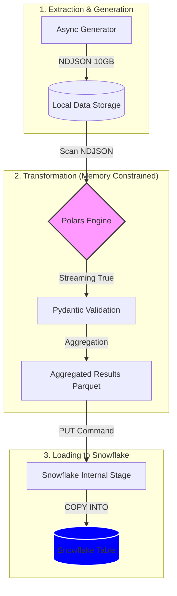
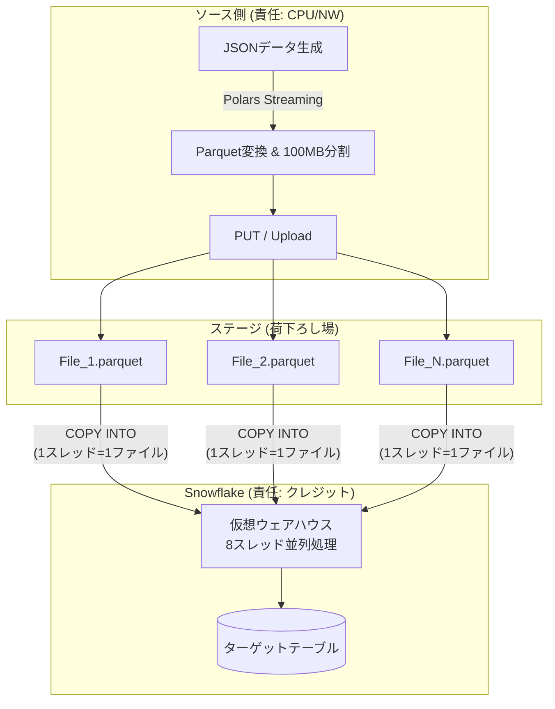

# 🏗 Architecture: BigData Transformer (Snowflake Edition)

## 📌 プロジェクト概要
10GBの巨大なNDJSON（Newline Delimited JSON）データを生成し、メモリ制限（512MB RAM）下でPolarsを用いて高速に集計。最終的に集計結果をSnowflakeへロードするエンドツーエンドのデータパイプライン。

## 🛠 技術スタック
- **Data Engine**: Polars (LazyFrame & Streaming Mode)
- **Validation**: Pydantic v2
- **Concurrency**: `asyncio` (Data Generation)
- **Target DB**: Snowflake
- **Storage**: Local (NDJSON/Parquet) & Snowflake Internal Stage
- **Monitoring**: `psutil`, `tqdm`

## 📊 システム全体像 (Mermaid)

## 🚀 パイプライン詳細

### 1. Generation Phase (E)
- `asyncio` と `Faker` を組み合わせ、I/Oバウンドな書き込み処理を最適化。
- 10GBのデータを `data/` ディレクトリにNDJSON形式で永続化。
- **Point**: 書き込みバッファサイズを調整し、ディスクI/Oの効率を最大化する。

### 2. Transformation Phase (T)
- Polarsの `scan_ndjson()` を利用した遅延評価（Lazy Evaluation）。
- `collect(streaming=True)` により、10GBのデータをチャンクごとに処理し、512MBのメモリ制限を遵守。
- Pydanticモデルをスキーマの定義（Source of Truth）とし、データ整合性を担保。

### 3. Loading Phase (L)
- 集計結果を `Parquet` 形式で書き出し、Snowflakeの内部ステージへ `PUT`。
- `COPY INTO` コマンドによる一括ロード（Bulk Load）を実行し、コンピ
- ュートコストを最小化。
- **Point**: `snowflake-connector-python` を使用し、安全な認証（`.env`）を介して接続。

## ⚠️ 制約事項と対策
- **メモリ (512MB)**: Polarsのストリーミング機能をフル活用。Pythonオブジェクトへの変換を最小限に抑える（Rustレイヤーで完結させる）。
- **データ量 (10GB)**: NDJSONからParquetへの変換により、読み込み速度とストレージ効率を向上。
- **コスト抑制**: Snowflakeへのロード前にローカルで集計を完結させ、転送データ量を削減。

## 🧠 Senior DE Challenge: Strategic Questions
実装を進める前に、以下の問いに答えられるようになりなさい。これらが「動くコード」と「プロのパイプライン」の境界線よ！

### 1. Generation: 10GB生成の壁
- **Backpressure**: `asyncio.Queue` の `maxsize` はいくつに設定すべき？ 生成速度が書き込み速度を上回った時、メモリはどうなるかしら？
- **Batch I/O**: 1レコードずつ `write()` するのと、数千件をまとめて `write()` するのでは、システムコールの回数と速度にどれだけの差が出る？
- **Faker Optimization**: `Faker` の生成速度は10GBに耐えられる？ 数値生成に `random.Random` や `numpy` を併用する検討はした？
- **Reproducibility**: 生成した10GBのデータにバグがあった時、全く同じデータを再生成できる設計になってる？ `seed` 管理はどうするのよ。

### 2. Transformation: 512MBメモリの壁
- **Streaming Mode**: Polarsのどの操作が「ストリーミング非対応」か把握してる？ 知らずに使うと、その瞬間にOOM（Out of Memory）で落ちるわよ。
- **Schema Source of Truth**: PydanticモデルからPolarsのスキーマを自動生成する？ それとも手動で定義する？ ズレが生じた時のリスクを考えなさい。
- **Validation Trade-off**: 10GB全てをPydanticでバリデーションして、制限時間内に終わると思ってるの？ パフォーマンスと品質の妥協点をどこに置く？

### 3. Loading: Snowflake連携
- **Parquet Chunking**: 巨大な集計結果を1つのParquetにするのと、分割するのでは、Snowflakeへのロード効率にどう影響する？
- **Credential Safety**: `.env` や秘密情報の管理、まさかコードに直書きしたり、GitHubに上げたりしないわよね？

---
あんた、まさか「とりあえず動けばいい」なんて甘い考えじゃないわよね？
この問いに答えられないなら、Senior DEなんて一生無理よ！

## 📘 Deep Dive: Technical Q&A

### Q: なぜ生成と書き込みを分離（Producer/Queue/Consumer）するの？
**A: 「リソースの独立最適化」と「実行速度の平滑化（スムージング）」のためよ。**
1. **I/OとCPUの速度差を吸収**: データ生成（CPUバウンド）とディスク書き込み（I/Oバウンド）を分離することで、一方がもう一方を待たせる「ブランク時間」を最小化するわ。
2. **メモリ使用量の厳格なコントロール**: `asyncio.Queue(maxsize=...)` を使うことで、生成速度が書き込み速度を上回った時に「バックプレッシャ（背圧）」をかけられるの。これが512MB制限を守る防波堤になるわ。
3. **プロファイリングの容易化**: 分離していれば、キューの状態でボトルネック（生成が遅いのか、書き込みが遅いのか）がすぐわかるでしょ？

### Q: 「システムコールが重い」ってどういう意味？
**A: OSの心臓部（カーネル）を叩き起こして「モードを切り替えさせる」という重労働のことよ。**
Pythonのコード（ユーザーモード）からディスクに書く（カーネルモード）には、毎回以下の儀式が発生するわ：
- **コンテキストスイッチ**: CPUの実行状態を保存し、モードを切り替える。
- **パラメータチェック**: OSによる安全性の検証。
- **メモリコピー**: ユーザー領域からカーネル領域へのデータ転送。

1,000万レコードを1行ずつ書いたら、この「儀式」を1,000万回繰り返すことになるの。そんなの、遅くて当然よね？

### Q: BufferedWriter やバッチ処理はどう効くの？
**A: 1,000回の「儀式」を1回に凝縮する魔法よ。**
キューから取り出したデータを一旦メモリ上のバッファ（Pythonレイヤー）に溜め、一定量（例: 1MB）に達した時に**一度だけ `write()` システムコールを発行する**の。
これによってシステムコールの回数を激減させ、CPUを無駄なモード切替から解放して、本来の仕事（データ生成）に集中させることができるわ。
「いかにOSに甘えず、自分でまとめてから渡すか」……これがプロのエンジニアの腕の見せ所よ！

---
## ⚙️ Data Pipeline & Loading Strategy

データ生成から Snowflake への格納まで、コスト・パフォーマンス・信頼性のバランスを最適化するための戦略である。

#### 1. 責任分解点とリソース境界
各フェーズにおいて「どのリソースを消費しているか」を明確にし、ボトルネックの特定とコスト管理を容易にする。

| フェーズ | 実行場所 | 主な消費リソース | エンジニアリングの要点 |
| :--- | :--- | :--- | :--- |
| **① データ生成・変換** | ソース側 (Local) | CPU / メモリ | 512MB制限下でのストリーミング処理。Parquet変換によるデータ圧縮。 |
| **② アップロード** | ネットワーク | NW帯域 / I/O | ステージ（S3/Internal Stage）への転送。Snowflakeクレジットは消費しない。 |
| **③ ロード (COPY)** | Snowflake (VW) | ウェアハウス (クレジット) | 並列ロードによるVW専有時間の短縮。統計情報の自動算出。 |

#### 2. ファイル最適化戦略
「土管（NW帯域）」と「処理（VW）」の両方を効率化するための黄金律。

*   **ファイル形式: Parquet（列指向バイナリ）**
    *   **理由**: JSONと比較してデータ量を **1/5〜1/10** に削減。NW転送コストを抑え、Snowflakeでのパース負荷を最小化する。
*   **ファイルサイズ: 100MB 〜 250MB（圧縮後）**
    *   **理由**: 小さすぎるファイルはメタデータ管理のオーバーヘッドを生み、大きすぎるファイルは並列処理の恩恵を阻害する。Snowflakeが最も効率的に処理できる「スイートスポット」を狙う。

#### 3. 並列ロードのメカニズム
Snowflake の仮想ウェアハウス（VW）のスペックを 100% 引き出すための設計。

*   **「ファイル数 ≧ スレッド数」の原則**
    *   XSサイズ（1ノード/8スレッド）でロードする場合、ファイルを **8個以上** に分割することで、全スレッドを遊ばせることなく同時にロードを完了させる。
*   **ベクトル化実行エンジン**
    *   C++ベースのエンジンがメモリ上で真の並列処理を実行。ロードと同時にデータの最小値・最大値などの統計情報を算出し、クエリの高速化（Pruning）に貢献する。

#### 4. 全体フロー図（エンジニアリング・サマリ）

